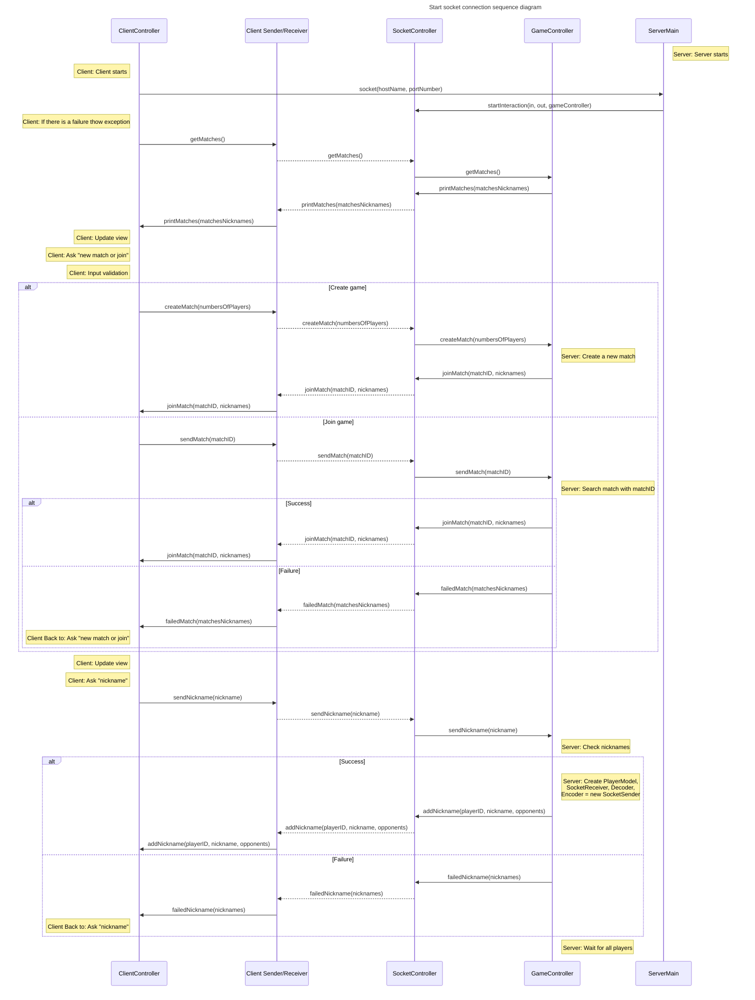
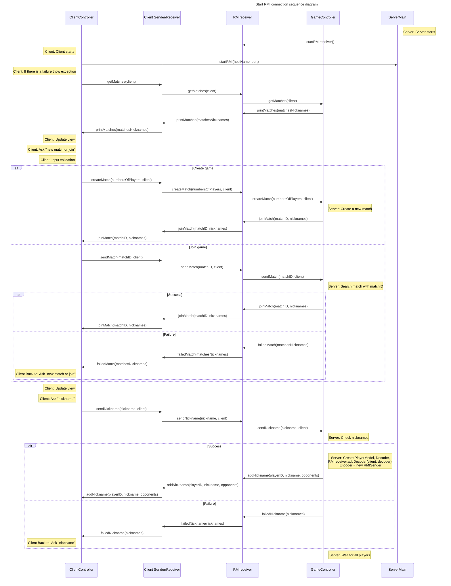
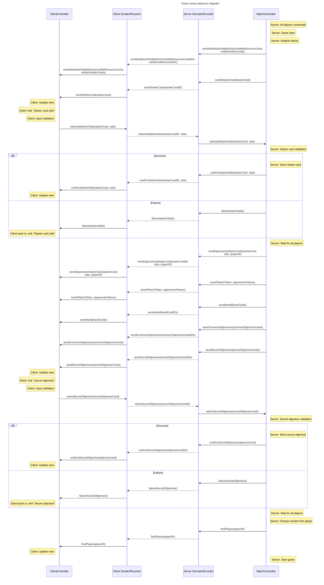
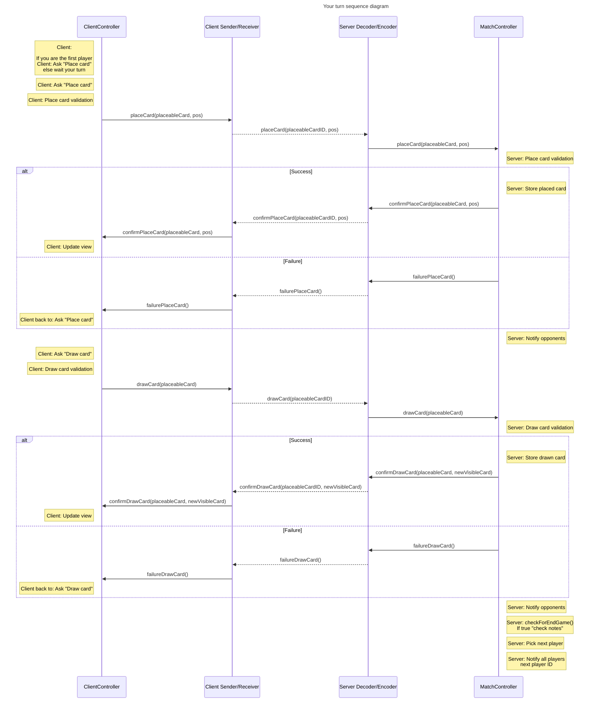
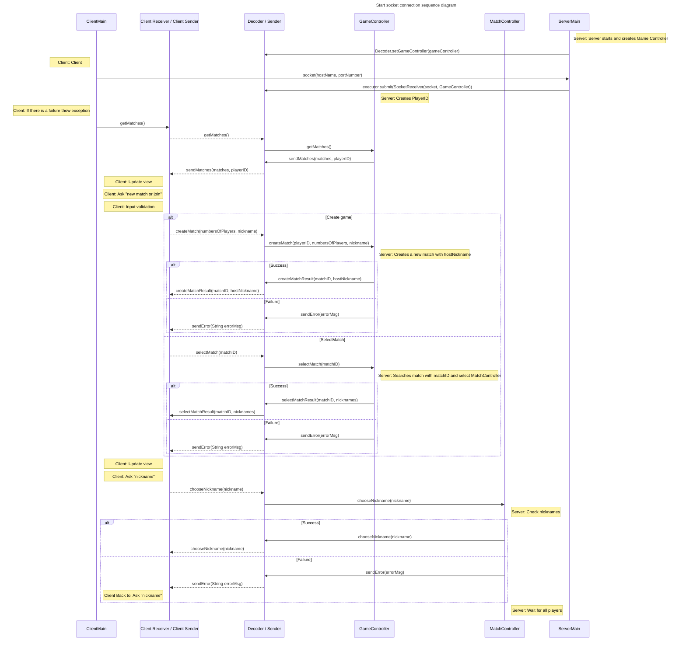
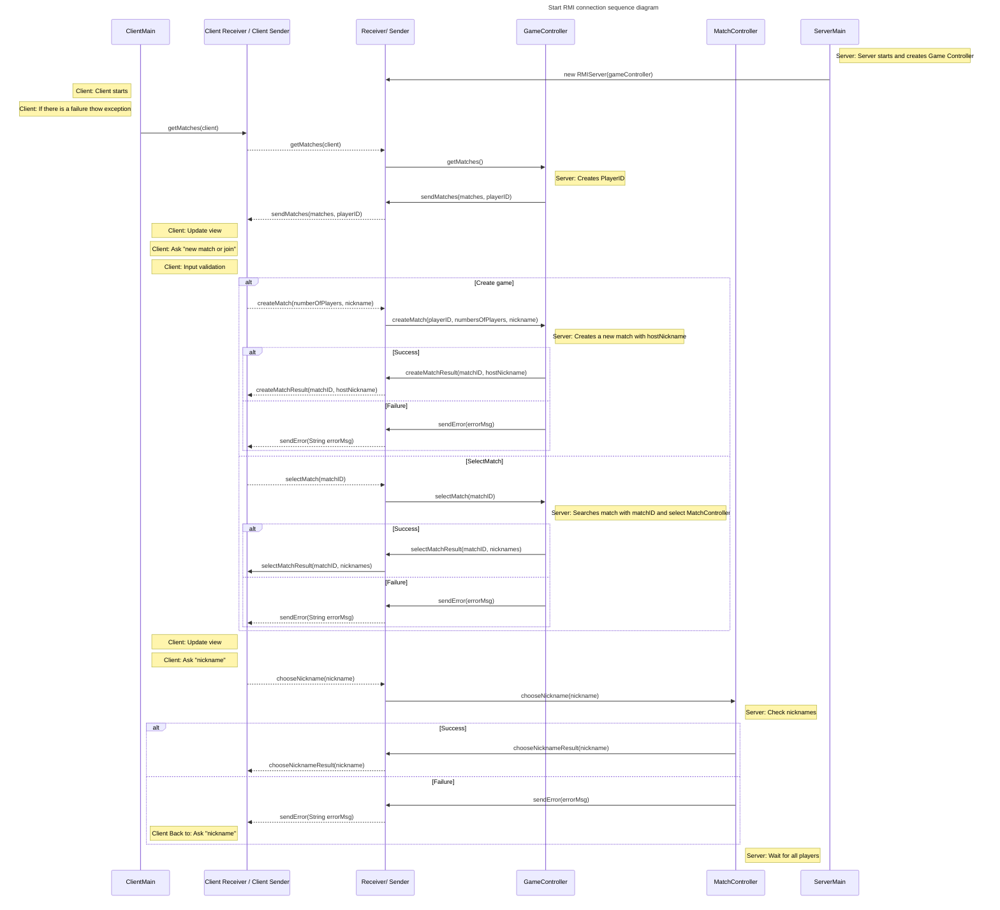

# IS24-AM17

Initial UML


Post review UML


UML 2 Peer Review

```mermaid

classDiagram

class PlaceableCard{
    <<Abstract>>
    - cardType : String
    - id : int
    - elementType : CardElementType
    - priority : int
    - chosenSide : Side
    - front : Side
    - back : Side

    + getId() int
    + getElementType() CardElementType
    + setPriority(int newPriority) void
    + getChosenSide() Side
    + setChosenSide(Side chosenSide) void
    + getFront() Side
    + getBack() Side
    + getResources(Side chosenSide) List ~ ResourceType ~
    + hasEnoughRequiredResources(int[] numOfResourcesArr) abstract boolean
    + calculatePlacementPoints(int numOfCoveredCorners, int[] numOfResourcesArr) abstract int
}

class ResourceCard{
    - points : int

    + getPoints() int
}

class GoldenCard{
    - pointsPerResource : int
    - pointsPerCoveredCorner : int
    - isPointPerResource : boolean
    - pointPerResourceRes : ResourceType
    - requiredResources : HashMap ~ ResourceType, Integer ~
    - points : int
    
    + getPoints() int
}

class ObjectiveCard{
    <<abstract>>
    - id : int
    - points : int 
    - objectiveType : String

    + getId() int
    + getPoints() int
    + calculateObjectivePoints(HashMap ~PlaceableCard, Position~ playArea, int[] numOfResourcesArr) int
}

class ResourcesCountObjectiveCard{
    - points : int
    - resourceType : ResourceType
    - requiredResourceCount : int
}

class TrinityObjectiveCard{
    - points : int
}

class DiagonalObjectiveCard{
    <<abstract>>
    - points : int
    - elementType: CardElementType

    # calculateObjectivePoints(HashMap~Position, PlaceableCard~ playArea, int direction) int
}

class TLBRDiagonalObjectiveCard{
    - direction : int
}

class TRBLDiagonalObjectiveCard{
    - direction : int
}

class LShapeObjectiveCard{
    <<abstract>>
    - points : int
    - mainElementType: CardElementType
    - secondaryElementType: CardElementType
    
    # calculateObjectivePoints(HashMap~Position, PlaceableCard~ playArea, int xDirection, int yDirection) int
}

class TLLShapeObjectiveCard{
    - xDirection : int
    - yDirection : int
}

class TRLShapeObjectiveCard{
    - xDirection : int
    - yDirection : int
}

class BLLShapeObjectiveCard{
    - xDirection : int
    - yDirection : int
}

class BRLShapeObjectiveCard{
    - xDirection : int
    - yDirection : int
}

ObjectiveCard <|-- DiagonalObjectiveCard
ObjectiveCard <|-- LShapeObjectiveCard
ObjectiveCard <|-- ResourcesCountObjectiveCard
ObjectiveCard <|-- TrinityObjectiveCard

DiagonalObjectiveCard <|-- TLBRDiagonalObjectiveCard
DiagonalObjectiveCard <|-- TRBLDiagonalObjectiveCard

LShapeObjectiveCard <|-- TLLShapeObjectiveCard
LShapeObjectiveCard <|-- TRLShapeObjectiveCard
LShapeObjectiveCard <|-- BLLShapeObjectiveCard
LShapeObjectiveCard <|-- BRLShapeObjectiveCard

PlaceableCard <|-- ResourceCard
PlaceableCard <|-- GoldenCard
PlaceableCard <|-- StarterCard
PlaceableCard *-->"3" Side

ResourceCard "cardType"*-->"1" CardElementType
GoldenCard "cardType"*-->"1" CardElementType

class Side{
    <<abstract>>
    - sideType : String
    - BLCorner : CardCorner
    - BRCorner : CardCorner
    - TLCorner : CardCorner
    - TRCorner : CardCorner

    + getTRCorner() CardCorner
    + getBRCorner() CardCorner
    + getBLCorner() CardCorner
    + getTLCorner() CardCorner
    + getResources() List ~ ResourceType ~
}

class Back{
    - permanentResources : List ~ ResourceType ~
}

%% class Front{
    
%% }

Side <|-- Front
Side <|-- Back
Side *-->"4" CardCorner

class CardCorner{
    <<abstract>>
    - cornerType : String

    + isAvailable() boolean
    + getResource() ResourceType
}

class ResourceCorner{
    - resourceType : ResourceType    
}

class VisibleCorner{
    <<abstract>>
}

CardCorner <|-- VisibleCorner
CardCorner <|-- HiddenCorner
VisibleCorner <|-- ResourceCorner
VisibleCorner <|-- EmptyCorner

class Position{
    - xPos : int
    - yPos : int

    + getX() int
    + getY() int
}

class CardElementType{
    <<enumeration>>
    STARTER
    ANIMAL
    PLANT
    FUNGI
    INSECT
}

class ResourceType{
    <<enumeration>>
    ANIMAL
    PLANT
    FUNGI
    INSECT
    QUILL
    INKWELL
    MANUSCRIPT
    

    - value : int
    - str : String

    + getValue() int
    + resourceTypeFromString(String str) ResourceType
}

class PlayerModel{
    - nickname : String
    - id : int
    - hand : List ~ PlaceableCard ~

    - objectiveToChoose : List ~ ObjectiveCard ~
    - secretObjective : ObjectiveCard
    - starterCard : PlaceableCard


    - playArea : HashMap ~ Position, PlaceableCard ~
    - numOfResourcesArr : int[]
    - currScore : int
    - numOfCompletedObjectives : int

    - token : Token
    - firstPlayerToken : Token

    - state : PlayerState
    - currMaxPriority : int

    - sender : Encoder

    + getID() int
    + getNickname() String
    + getHand() List ~ PlaceableCard ~

    + setObjectivesToChoose(List ~ ObjectiveCard ~ objectives) void
    + getSectretObjective() ObjectiveCard
    + setSecretObjective(int index) void
    + getStarterCard () PlaceableCard
    + setStarterCard(PlaceableCard sCard) void
    + getPlayArea() HashMap ~ Position, PlaceableCard ~
    + getNumOfResourcesArr() int[]
    + getCurrScore() int
    + setCurrScore(int score) void
    + getNumOfCompletedObjectives() int
    + setToken(Token token) void
    + isFirstPlayer() boolean
    + setAsFirstPlayer(boolean isFirstPlayer) void
    + getState() PlayerState
    + setState(PlayerState state) void
    + getCurrMaxPriority() int
    + placeStarterCard(Side chosenSide) void

    + placeCard(PlaceableCard card, Position pos, Side chosenSide) void
    + getAdjacentCorners(Position pos) List ~ CardCorner ~
    + calculateObjectivePoints(ObjectiveCard oCard) void
    + drawCard(PlaceableCard card) void
    + requestError() void
    
}

class PlayerState{
    <<enumeration>>
    PRE_GAME
    PLACING_STARTER
    CHOOSING_TOKEN
    CHOOSING_OBJECTIVE
    WAITING
    PLACING
    DRAWING
}

%% class PlayerView{
%%     <<Mettere>>
%%     + setStarterCardChoice() void
%%     + flipStarterCard() void
%%     + placeStarterCard() void
%%     + placeCard(card : Card) void
%% }

class GameResources{
    - resourceCardsFilename : String
    - goldenCardsFilename : String
    - starterCardsFilename : String
    - objectiveCardsFilename : String

    - goldenDeck : List ~ PlaceableCard ~
    - resourcesDeck : List ~ PlaceableCard ~
    - starterDeck : List ~ PlaceableCard ~
    - objectiveDeck : List ~ ObjectiveCard ~

    - IDToPlaceableCardMap : ~Integer, PlaceableCard~
    - IDToObjectiveCardMap : ~Integer, ObjectiveCard~


    + deserializeCorner() CardCorner
    + deserializeFront() Side
    + deserializeBack() Side
    + deserializeResourceCard() PlaceableCard
    + deserializeGoldenCard() PlaceableCard
    + deserializeStarterCard() PlaceableCard
    + deserializeObjectiveCard() ObjectiveCard
    + initializeResourceDeck() void
    + initializeGoldenDeck() void
    + initializeStarterDeck() void
    + initializeObjectiveDeck() void
    + fillCardMaps() void
    + initializeAllDecks() void

    + getPlaceableCardByID(int ID) PlaceableCard
    + getObjectiveCardByID(int ID) PlaceableCard

    + getResourcesDeck() List ~ PlaceableCard ~
    + getGoldenDeck() List ~ PlaceableCard ~
    + getStarterDeck() List ~ PlaceableCard ~
    + getObjectiveDeck() List ~ ObjectiveCard ~
    + getIDToPlaceableCardMap() Map ~Integer, PlaceableCard~
    + getIDToObjectiveCardMap() Map ~Integer, ObjectiveCard~
}

class MatchModel{
    - maxPlayers : int
    - currPlayers : int
    - matchID : int

    - IDToPlayerMap : HashMap ~ Integer, PlayerModel ~

    - resourceCardsDeck : UsableCardsDeck
    - goldenCardsDeck : UsableCardsDeck
    - objectiveCardsDeck : ObjectiveCardsDeck
    - starterCardsDeck : StarterCardsDeck

    - currPlayerID : int
    - firstPlayerID : int
    - orderOfPlayersIDs : int[]

    - gameState : GameState

    + getIDToPlayerMap() HashMap ~ Integer, PlayerModel ~
    + getNicknames() List ~ String ~
    + getNicknamesMap(int currPlayerID) HashMap ~ Integer, String ~
    + getMaxPlayers() int
    + getCurrPlayers() int
    + getMatchID() int
    + getResourceCardsDeck() UsableCardsDeck
    + getGoldenCardsDeck() UsableCardsDeck
    + getObjectiveCardsDeck() ObjectiveCardsDeck
    + getStarterCardsDeck() StarterCardsDeck
    + getCurrPlayerID() int
    + getGameState() GameState
    + setGameState(GameState gameState) void
    + addPlayer(PlayerModel player) void

    + initializeDecks() void
    + shuffleAllDecks() void
    + setVisibleCards() void
    + drawResourceCard() PlaceableCard
    + drawGoldenCard() PlaceableCard
    + drawStarterCard() PlaceableCard
    + drawObjectiveCard() ObjectiveCard
    + drawVisibleResourceCard(int index) PlaceableCard
    + drawVisibleGoldenCard(int index) PlaceableCard
    + restoreVisibleResourceCard() void
    + restoreVisibleGoldenCard() void
    + setRandomFirstPlayer() void
    + calculateOrderOfPlayers() void
    + endTurn() void
    + checkForEndGame() void
    + manageEndGame() void
    + determineRanking() void
}

MatchModel *-->"2" UsableCardsDeck
MatchModel *-->"1" ObjectiveCardsDeck
MatchModel *-->"1" StarterCardsDeck

class UsableCardsDeck{
    - deck : List ~ PlaceableCard ~
    - visibleCards : List ~ PlaceableCard ~

    + getDeck() List ~ PlaceableCard ~
    + getVisibleCards() List ~ PlaceableCard ~
    + shuffleDeck() void
    + restoreInitialVisibleCards() void
    + drawCard() PlaceableCard
    + drawVisibleCard(int index) PlaceableCard
    + restoreVisibleCards() void
    + restoreVisibleCardWithOtherDeck(PlaceableCard card) void
    + isDeckEmpty() boolean

}

class ObjectiveCardsDeck{
    - deck : List ~ ObjectiveCard ~
    - commonObjectives : List ~ ObjectiveCard ~

    + getDeck() List ~ ObjectiveCard ~
    + getCommonObjectives() List ~ ObjectiveCard ~

    + shuffleDeck() void
    + drawCard() ObjectiveCard
    + setCommonObjectives() void
}

class StarterCardsDeck{
    - deck : List ~ StarterCard ~

    + getDeck() List ~ PlaceableCard ~
    + shuffleDeck() void
    + drawCard() PlaceableCard
}

class MatchController{
    
    - IDPlayerMap : Map ~ Integer, PlayerModel ~
    - matchModel : MatchModel

    + getIDPlayerMap() Map ~ Integer, PlayerModel ~
    + getMatchModel() MatchModel

    + addPlayer(String nickname, PrintWriter out) Integer
    + addPlayer(String nickname, ClientRMIInterface clientRMI) Integer

    + setUpGame() void
    + initializeDecks() void
    + shuffleAllDecks() void
    + setVisibleCards() void
    + setCommonObjectives() void
    + setObjectivesToChoose(int playerID) void
    + setRandomFirstPlayer() void
    + calculateOrderOfPlayers() void
    + placeCard(int playerID, int cardID, Position pos, Side chosenSide) void
    + fillPlayerHand(int playerID) void
    + drawResourceCard(int platerId) void
    + drawVisibleResourceCard(int playerID, int index) void
    + drawGoldenCard(int playerID) void
    + drawVisibleGoldenCard(int playerID, int index) void
    + drawStarterCard(int playerID) void

    + endGameSetUp() void
    + endTurn() void
    - checkPlayerDrawExceptions(int playerID) void
    + requestError(int playerId) void

    %% nuovi metodi da implementare
    + selectedStarterSide(int playerID, PlaceableCard starterCard, Side side) void
    + selectSecretObjective(int playerID, int secretObjectiveCardID) void
    + drawCard(PlaceableCard placeableCardID) void

}

MatchController *-->"1" MatchModel
MatchController *-->"1 ... n" PlayerModel

class Token{
    - color : TokenColors

    + getColor() TokenColors
}
class TokenColors{
    <<enumeration>>
    RED
    BLUE
    GREEN
    YELLOW
    BLACK

    + getColorFromInt(int n) TokenColors
}

class GameModel{
    - matches : List ~ MatchController ~

    + getMatches() Map ~Integer, List ~String~ ~
    + getMatch(int matchID) MatchController
    + createGame(int numberOfPlayers) MatchController
    + selectGame(int matchId) void
    + startGame(MatchController matchController) void
}

class GameController{
    - gameModel : GameModel

    + getGameModel() GameModel


    + beginGameCreation() void


    + createGame(int numberOfPlayers) MatchController
    + selectGame(int matchID) MatchController
    + joinMatch(MatchController matchController, String nickname, PrintWriter out, BufferedReader in) Integer
    + joinMatch(MatchController matchController, String nickname, ClientRMIInterface client) Integer
    # analyzePlayerNumber(MatchController matchController)
    - sendMessage(String output, PrintWriter out) void
    - getMatchesSoket() String
    - getMatches() Map ~ Integer, List ~String~ ~
    - getMatchesNicknames(MatchController matchController) List ~String~
    + getMatches(PrintWriter out) void
    + getMatches(ClientRMIInterface client) void
    - sendMatch(int matchID) MatchController
    + sendMatch(int matchID, PrintWriter out) MatchController
    + sendMatch(int matchID, ClientRMIInterface client) MatchController
    + sendNickname(MatchController matchController, String nickname, PrintWriter out, BufferedReader in) void
    + sendNickname(MatchController matchController, String nickname, ClientRMIInterface client) void
    - createMatch(int numberOfPlayers) MatchController
    + createMatch(int numberOfPlayers, PrintWriter out) MatchController
    + createMatch(int numberOfPlayers, ClientRMIInterface client) MatchController
}

GameModel *-->"1...n" MatchController
GameController *-->"1" GameModel

class GameState{
    <<enumeration>>
    PREGAME
    SET_UP
    PLAYING
    FINAL_ROUND
    EXTRA_ROUND
    END_GAME
}

class Encoder{
    <<abstract>>
    + sendId(int id) void
    + setState(PlayerState state) void
    + setCurrScore(int score) void
    + setToken(token token) void
    # setTokenEncoded(TokenColors color) void
    + setObjectiveToChoose(List~ObjectiveCard~ objectives) void
    # setObjectivesToChooseEncoded(List~Integer~ objectiveIDs) void
    + setFirstPlayerToken(Token token) void
    # setFirstPlayerTokenEncoded(TokenColors color) void
    + addCardToPlayerHand(PlaceableCard card) void
    # addCardToPlayerHandEncoded(int id) void

    + setSecretObjective(ObjectiveCard card) void
    # setSecretObjectiveEncoded(int id) void
    + setStarterCard(PlaceableCard card) void
    # setStarterCardEncoded(int id) void
    + placeStarterCard(boolean placed) void
    + placeCard(boolean placed) void
    + requestError() void
}

class RMISender{
    - client : ClientRMIInterface
}

class SocketSender{
    - out : PrintWriter
    # SendMessage(String output) void
}

Encoder <|-- RMISender
Encoder <|-- SocketSender

PlayerModel*--> "1" Encoder

class Decoder {
    - matchController : MatchController
    - playerId : int

    + placeCard(int id, Position pos) void
    # placeCardDecoded(PlaceableCard card, Position pos) void
    + drawResourceCard() void
    + drawVisibleResourceCard(int playerID, int index) void
    + drawGoldenCard(int playerID) void
    + drawVisibleGoldenCard(int playerID, int index) void
    + requestError() void

    %% metodi nuovi da implementare
    + selectedStarterSide(in starterCardID, Side side) void
    # selectedStarterSideDecoded(PlaceableCard starterCard, Side side) void
    + selectSecretObjective(int secretObjectiveCardID) void
    # selectSecretObjectiveDecoded(PlaceableCard secretObjectiveCardID) void
    + drawCard(int placeableCardID) void
    # drawCard(PlaceableCard placeableCardID) void

}
RMIReceiver*--> "1...n"Decoder
SocketReceiver*--> "1" Decoder

class RMIReceiverInterface {
    <<Interface>>
    + getMatches(ClientRMIInterface client) void
    + sendMatch(int matchID, ClientRMIInterface client) void
    + sendNickname(String nickname, ClientRMIInterface client) void
    + createMatch(int numberOfPlayers, ClientRMIInterface client) void
    + placeCard(int id, Position pos, ClientRMIInterface client) void
    + drawResourceCard(ClientRMIInterface client) void
    + drawVisibleResourceCard(int playerID, int index, ClientRMIInterface client) void
    + drawGoldenCard(int playerID, ClientRMIInterface client) void
    + drawVisibleGoldenCard(int playerID, int index, ClientRMIInterface client) void
    + requestError(ClientRMIInterface client) void

    + createGame(ClientRMIInterface client, String nickname, int numberOfPlayers) void
    + selectMatch(ClientRMIInterface client, int matchID) MatchController
    + joinMatch(MatchController matchController, String nickname, ClientRMIInterface client) void

    %% metodi nuovi da implementare
    + selectedStarterSide(int starterCardID, Side side) void
    + selectSecretObjective(int secretObjectiveCardID) void
    + drawCard(int placeableCardID) void

}

RMIReceiverInterface <|-- RMIReceiver : implements

class RMIReceiver {
    - clientRMIDecoderHashMap : HashMap ~ClientRMIInterface, Decoder~
    - gameController : GameController
    - MatchControllerHashMap : HashMap~ClientRMIInterface, MatchController~

    + addDecoder(ClientRMIInterface client, Decoder decoder) void
    - addMatchController(ClientRMIInterface client, MatchController matchController) void
    - getMatchController(ClientRMIInterface client) MatchController

}

class SocketReceiver {
    - decoder : Decoder

    # messageDecoder(String input) void
}

class ClientRMIInterface {
    <<Interface>>
    + printMatches(Map~Integer, List~String~~ matchesNicknames) void
    + failedMatch(Map~Integer, List~String~~ matchesNicknames) void
    + joinMatch(int matchID, List~String~ nicknames) void
    + addNickname(Integer playerID, String nickname, Map~Integer, String~ opponents) void
    + failedNickname(List~String~ nicknames)
    + sendID(int id) void
    + setState(PlayerState state) void
    + setCurrScore(int score) void
    + setToken(TokenColors color) void
    + setObjectivesToChoose(List~Integer~ objectiveIDs) void
    + setFirstPlayerToken(TokenColors color) void
    + addCardToPlayerHand(int id) void
    + setSecretObjective(int id) void
    + setStarterCard(int id) void
    + placeStarterCard(boolean placed) void
    + placeCard(boolean placed) void
    + sendInitializedVisibleDecks(List ~ Integer ~ visibleResourceCardsIDs, List ~ Integer ~ visibleGoldenCardsIDs) void
    + sendStarterCard(int starterCardID) void
    + confirmStarterSide(int starterCardID, Side side) void
    + failureStarterSide() void
    + sendOpponentsStarterCard(int starterCardID, Side side, int playerID) void
    + sendToken(Token token, List~Token~ opponentsTokens) void
    + sendHand(List ~ Integer ~ handCardIDs) void
    + sendCommonObjectives(List ~ Integer ~commonObjectiveCardsIDs) void
    + sendSecretObjectives(List ~ Integer ~ secretObjectiveCardsIDs) void
    + confirmSecretObjective(int objectiveCardID) void
    + failureSecretObjective() void
    + firstPlayer(int playerID) void
    + confirmPlaceCard(int placeableCardID, Position pos) void
    + failurePlaceCard() void
    + confirmDrawCard(int placeableCardID, newVisibleCard) void
    + failureDrawCard() void
}

class RMIController {
    - gameController : GameController
    - startRMIReceiver(String[] args) void
}
class SocketController {
    + startServerConnection(String[] args) ServerSocket
    + connectClient(ServerSocket serverSocket) Socket
    + createClientConnectionOUT(Socket connectionSocket) PrintWriter
    + waitClientConnectionIN(Socket connectionSocket) BufferedReader
    + startInteraction(BufferedReader in, PrintWriter out, GameController gameController) void
    + messageDecoder(String input, GameController gameController, MatchController matchController, PrintWriter out, BufferedReader in) MatchController
}

```

Start socket connection sequence diagram



Start RMI connection sequence diagram



Sequence diagram for game setup



Your turn sequence diagram



End game sequence diagram


New Start socket connection sequence diagram



New Start RMI connection sequence diagram


