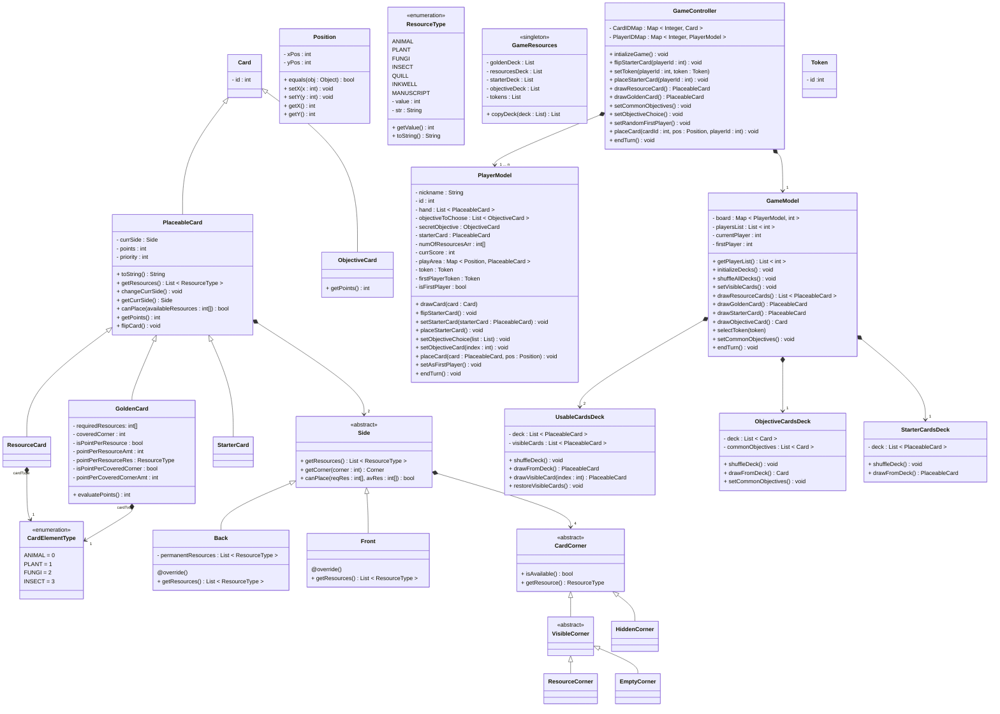

# IS24-AM17

```mermaid
classDiagram

class Card{
    - id : int
}

class PlaceableCard{
    - currSide : Side
    - points : int
    - priority : int

    + toString() String
    + getResources() List ~ ResourceType ~
    + changeCurrSide() void
    + getCurrSide() Side
    + canPlace(availableResources : int[]) bool
    + getPoints() int
    + flipCard() void
}

%% class ResourceCard{
%%     - cardType : ResourceType
%% }

class GoldenCard{
    - requiredResources: int[]
    - coveredCorner : int

    - isPointPerResource : bool
    - pointPerResourceAmt : int
    - pointPerResourceRes : ResourceType

    - isPointPerCoveredCorner : bool
    - pointPerCoveredCornerAmt : int
    
    + evaluatePoints() int
}

%% class StarterCard{

%% }

class ObjectiveCard{
    + getPoints() int
}

Card <|-- PlaceableCard
Card <|-- ObjectiveCard
PlaceableCard <|-- ResourceCard
PlaceableCard <|-- GoldenCard
PlaceableCard <|-- StarterCard
PlaceableCard *-->"2" Side

ResourceCard "cardType"*-->"1" CardElementType
GoldenCard "cardType"*-->"1" CardElementType

class Side{
    <<abstract>>
    + getResources() List ~ ResourceType ~
    + getCorner(corner : int) Corner
    + canPlace(reqRes : int[], avRes : int[]) bool
}

class Back{
    - permanentResources : List ~ ResourceType ~

    @override()
    + getResources() List ~ ResourceType ~
}

class Front{
    @override()
    + getResources() List ~ ResourceType ~
}

Side <|-- Front
Side <|-- Back
Side *-->"4" CardCorner

class CardCorner{
    <<abstract>>
    + isAvailable() bool
    + getResource() ResourceType
}

%% class ResourceCorner{
    
%% }


CardCorner <|-- VisibleCorner
CardCorner <|-- HiddenCorner
VisibleCorner <|-- ResourceCorner
VisibleCorner <|-- EmptyCorner

class VisibleCorner{
    <<abstract>>
}

class Position{
    - xPos : int
    - yPos : int

    + equals(obj : Object) bool
    + setX(x : int) void
    + setY(y : int) void
    + getX() int
    + getY() int
}

class CardElementType{
    <<enumeration>>
    ANIMAL = 0
    PLANT = 1
    FUNGI = 2
    INSECT = 3
}

class ResourceType{
    <<enumeration>>
    ANIMAL
    PLANT
    FUNGI
    INSECT
    QUILL
    INKWELL
    MANUSCRIPT

    - value : int
    - str : String

    + getValue() int
    + toString() String
}

class PlayerModel{
    - nickname : String
    - id : int
    - hand : List ~ PlaceableCard ~

    - objectiveToChoose : List ~ ObjectiveCard ~

    - secretObjective : ObjectiveCard
    - starterCard : PlaceableCard

    - numOfResourcesArr : int[]

    - currScore : int

    - playArea : Map ~ Position, PlaceableCard ~

    - token : Token
    - firstPlayerToken : Token
    - isFirstPlayer : bool

    + drawCard(card : Card)
    + flipStarterCard() void
    + setStarterCard(starterCard : PlaceableCard) void
    + placeStarterCard() void
    + setObjectiveChoice(list : List) void
    + setObjectiveCard(index : int) void
    + placeCard(card : PlaceableCard, pos : Position) void
    + setAsFirstPlayer() void
    + endTurn() void
}

%% class PlayerView{
%%     <<Mettere>>
%%     + setStarterCardChoice() void
%%     + flipStarterCard() void
%%     + placeStarterCard() void
%%     + placeCard(card : Card) void
%% }

class GameResources{
    <<singleton>>
    - goldenDeck : List
    - resourcesDeck : List

    - starterDeck : List

    - objectiveDeck : List

    - tokens : List

    + copyDeck(deck : List) List
}

class GameModel{
    - board : Map ~ PlayerModel, int ~

    - playersList : List ~ int ~
    - currentPlayer : int
    - firstPlayer : int

    %% - visibleResourceCards : List ~ Card ~
    %% - resourceCardDeck : List ~ Card ~

    %% - visibleGoldenCards : List ~ Card ~
    %% - goldenCardDeck : List ~ Card ~

    %% - objectiveCardDeck : List ~ ObjectiveCard ~
    %% - commonObjectives : List ~ ObjectiveCard ~

    %% - starterCardDeck : List ~ Card ~

    + getPlayerList() List ~ int ~

    + initializeDecks() void
    + shuffleAllDecks() void
    + setVisibleCards() void
    + drawResourceCards() List ~ PlaceableCard ~
    + drawGoldenCard() PlaceableCard
    + drawStarterCard() PlaceableCard
    + drawObjectiveCard() Card

    %% + flipStarterCard(player: PlayerModel)
    %% + flipCard(card : Card)
    %% + placeCard(card : Card, player : PlayerModel)
    + selectToken(token)
    + setCommonObjectives() void
    %% + setObjectiveChoice() List
    + endTurn() void
}

GameModel *-->"2" UsableCardsDeck
%% UsableCardsDeck -->"1" ResourceCardDeck
%% UsableCardsDeck -->"1" GoldenCardDeck
GameModel *-->"1" ObjectiveCardsDeck
GameModel *-->"1" StarterCardsDeck

class UsableCardsDeck{
    - deck : List ~ PlaceableCard ~
    - visibleCards : List ~ PlaceableCard ~

    + shuffleDeck() void
    + drawFromDeck() PlaceableCard
    + drawVisibleCard(index : int) PlaceableCard
    + restoreVisibleCards() void
}

class ObjectiveCardsDeck{
    - deck : List ~ Card ~
    - commonObjectives : List ~ Card ~

    + shuffleDeck() void
    + drawFromDeck() Card
    + setCommonObjectives() void
}

class StarterCardsDeck{
    - deck : List ~ PlaceableCard ~

    + shuffleDeck() void
    + drawFromDeck() PlaceableCard
}

%% class GameView{
%%     + update() void
%% }

class GameController{
    - CardIDMap : Map ~ Integer, Card ~
    - PlayerIDMap : Map ~ Integer, PlayerModel ~

    + intializeGame() void
    + flipStarterCard(playerId : int) void
    + setToken(playerId : int, token : Token)
    + placeStarterCard(playerId : int) void
    + drawResourceCard() PlaceableCard
    + drawGoldenCard() PlaceableCard
    + setCommonObjectives() void
    + setObjectiveChoice() void
    + setRandomFirstPlayer() void
    + placeCard(cardId : int, pos : Position, playerId : int) void
    + endTurn() void
}

GameController*-->"1" GameModel
%% GameController*-->"1" GameView
GameController*-->"1 ... n" PlayerModel
%% GameController*-->"1 ... n" PlayerView

class Token{
    - id :int
}

```
