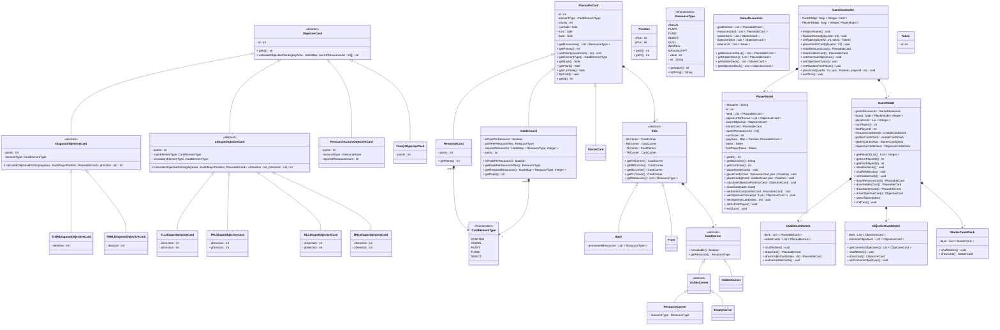
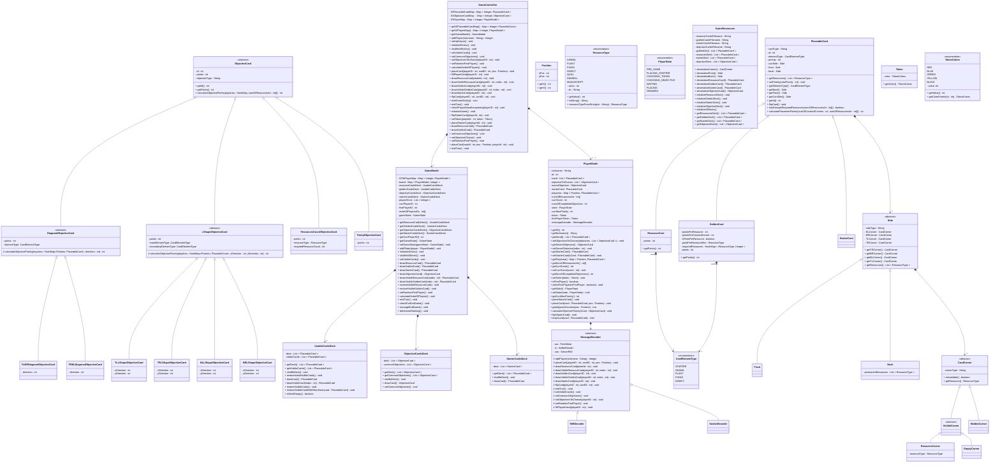
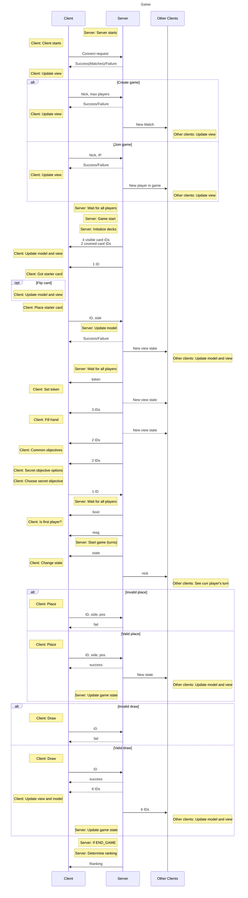

# IS24-AM17

Initial UML

```mermaid

classDiagram

class PlaceableCard{
    - id : int
    - elementType : CardElementType
    - priority : int
    - currSide : Side
    - front : Side
    - back : Side

    + getResources() List ~ ResourceType ~
    + getPriority() int
    + setPriority(newPriority : int) void
    + getElementType() CardElementType
    + getBack() Side
    + getFront() Side
    + getCurrSide() Side
    + flipCard() void
    + getId() int
}

class ResourceCard{
    - points : int

    + getPoints() int
}

class GoldenCard{
    - isPointPerResource : boolean
    - pointPerResourceRes : ResourceType
    - requiredResources : HashMap ~ ResourceType, Integer ~
    - points : int
    
    + isPointPerResource() boolean
    + getPointPerResourceRes() ResourceType
    + getRequiredResources() HashMap ~ ResourceType, Integer ~
    + getPoints() int
}

class ObjectiveCard{
    <<abstract>>
    - id : int

    + getId() int
    + calculateObjectivePoints(playArea : HashMap<PlaceableCard, Position>, numOfResourcesArr : int[]) int
}

class ResourcesCountObjectiveCard{
    - points : int
    - resourceType : ResourceType
    - requiredResourceCount : int
}

class TrinityObjectiveCard{
    - points : int
}

class DiagonalObjectiveCard{
    <<abstract>>
    - points : int
    - elementType: CardElementType

    # calculateObjectivePoints(playArea : HashMap~Position, PlaceableCard~, direction : int) int
}

class TLBRDiagonalObjectiveCard{
    - direction : int
}

class TRBLDiagonalObjectiveCard{
    - direction : int
}

class LShapeObjectiveCard{
    <<abstract>>
    - points : int
    - mainElementType: CardElementType
    - secondaryElementType: CardElementType
    
    # calculateObjectivePoints(playArea : HashMap~Position, PlaceableCard~, xDirection : int, yDirection : int) int
}

class TLLShapeObjectiveCard{
    - xDirection : int
    - yDirection : int
}

class TRLShapeObjectiveCard{
    - xDirection : int
    - yDirection : int
}

class BLLShapeObjectiveCard{
    - xDirection : int
    - yDirection : int
}

class BRLShapeObjectiveCard{
    - xDirection : int
    - yDirection : int
}

ObjectiveCard <|-- DiagonalObjectiveCard
ObjectiveCard <|-- LShapeObjectiveCard
ObjectiveCard <|-- ResourcesCountObjectiveCard
ObjectiveCard <|-- TrinityObjectiveCard

DiagonalObjectiveCard <|-- TLBRDiagonalObjectiveCard
DiagonalObjectiveCard <|-- TRBLDiagonalObjectiveCard

LShapeObjectiveCard <|-- TLLShapeObjectiveCard
LShapeObjectiveCard <|-- TRLShapeObjectiveCard
LShapeObjectiveCard <|-- BLLShapeObjectiveCard
LShapeObjectiveCard <|-- BRLShapeObjectiveCard

PlaceableCard <|-- ResourceCard
PlaceableCard <|-- GoldenCard
PlaceableCard <|-- StarterCard
PlaceableCard *-->"3" Side

ResourceCard "cardType"*-->"1" CardElementType
GoldenCard "cardType"*-->"1" CardElementType

class Side{
    <<abstract>>
    - BLCorner : CardCorner
    - BRCorner : CardCorner
    - TLCorner : CardCorner
    - TRCorner : CardCorner

    + getTRCorner() CardCorner
    + getBRCorner() CardCorner
    + getBLCorner() CardCorner
    + getTLCorner() CardCorner
    + getResources() List ~ ResourceType ~
}

class Back{
    - permanentResources : List ~ ResourceType ~
}

%% class Front{
    
%% }

Side <|-- Front
Side <|-- Back
Side *-->"4" CardCorner

class CardCorner{
    <<abstract>>
    + isAvailable() boolean
    + getResource() ResourceType
}

class ResourceCorner{
    - resourceType : ResourceType    
}

class VisibleCorner{
    <<abstract>>
}

CardCorner <|-- VisibleCorner
CardCorner <|-- HiddenCorner
VisibleCorner <|-- ResourceCorner
VisibleCorner <|-- EmptyCorner

class Position{
    - xPos : int
    - yPos : int

    + getX() int
    + getY() int
}

class CardElementType{
    <<enumeration>>
    STARTER
    ANIMAL
    PLANT
    FUNGI
    INSECT
}

class ResourceType{
    <<enumeration>>
    ANIMAL
    PLANT
    FUNGI
    INSECT
    QUILL
    INKWELL
    MANUSCRIPT

    - value : int
    - str : String

    + getValue() int
    + toString() String
}

class PlayerModel{
    - nickname : String
    - id : int
    - hand : List ~ PlaceableCard ~

    - objectiveToChoose : List ~ ObjectiveCard ~
    - secretObjective : ObjectiveCard
    - starterCard : PlaceableCard

    - numOfResourcesArr : int[]
    - currScore : int
    - playArea : Map ~ Position, PlaceableCard ~

    - token : Token
    - firstPlayerToken : Token

    + getID() int
    + getNickname() String
    + getCurrScore() int

    + placeStarterCard() void
    + placeCard(rCard : ResourceCard, pos : Position) void
    + placeCard(gCard : GoldenCard, pos : Position) void
    + calculateObjectivePoints(oCard : ObjectiveCard) void 

    %% Not implemented yet
    + drawCard(card : Card)
    + setStarterCard(starterCard : PlaceableCard) void
    + setObjectiveChoice(list : List ~ ObjectiveCard ~) void
    + setObjectiveCard(index : int) void
    + setAsFirstPlayer() void
    + endTurn() void
}

%% class PlayerView{
%%     <<Mettere>>
%%     + setStarterCardChoice() void
%%     + flipStarterCard() void
%%     + placeStarterCard() void
%%     + placeCard(card : Card) void
%% }

class GameResources{
    - goldenDeck : List ~ PlaceableCard ~
    - resourcesDeck : List ~ PlaceableCard ~

    - starterDeck : List ~ StarterCard ~

    - objectiveDeck : List ~ ObjectiveCard ~

    - tokensList : List ~ Token ~

    + getResourcesDeck() List ~ PlaceableCard ~
    + getGoldenDeck() List ~ PlaceableCard ~
    + getStarterDeck() List ~ StarterCard ~
    + getObjectiveDeck() List ~ ObjectiveCard ~
}

class GameModel{
    - gameResources : GameResources
    - board : Map ~ PlayerModel, Integer ~

    - playersList : List ~ Integer ~
    - currPlayerID : int
    - firstPlayerID : int

    - resourceCardsDeck : UsableCardsDeck
    - goldenCardsDeck : UsableCardsDeck
    - starterCardsDeck : StarterCardsDeck
    - ObjectiveCardsDeck : ObjectiveCardsDeck

    + getPlayerIDList() List ~ Integer ~
    + getCurrPlayerID() int
    + getFirstPlayerID() int

    + initializeDecks() void
    + shuffleAllDecks() void
    + setVisibleCards() void
    + drawResourceCard() PlaceableCard
    + drawGoldenCard() PlaceableCard
    + drawStarterCard() PlaceableCard
    + drawObjectiveCard() ObjectiveCard

    + selectToken(token)
    + endTurn() void
}

GameModel *-->"2" UsableCardsDeck
GameModel *-->"1" ObjectiveCardsDeck
GameModel *-->"1" StarterCardsDeck

class UsableCardsDeck{
    - deck : List ~ PlaceableCard ~
    - visibleCards : List ~ PlaceableCard ~

    + shuffleDeck() void
    + drawCard() PlaceableCard
    + drawVisibleCard(index : int) PlaceableCard
    + restoreVisibleCards() void
}

class ObjectiveCardsDeck{
    - deck : List ~ ObjectiveCard ~
    - commonObjectives : List ~ ObjectiveCard ~

    + getCommonObjectives() List ~ ObjectiveCard ~

    + shuffleDeck() void
    + drawCard() ObjectiveCard
    + setCommonObjectives() void
}

class StarterCardsDeck{
    - deck : List ~ StarterCard ~

    + shuffleDeck() void
    + drawCard() StarterCard
}

%% class GameView{
%%     + update() void
%% }

class GameController{
    - CardIDMap : Map ~ Integer, Card ~
    - PlayerIDMap : Map ~ Integer, PlayerModel ~

    + initializeGame() void
    + flipStarterCard(playerId : int) void
    + setToken(playerId : int, token : Token)
    + placeStarterCard(playerId : int) void
    + drawResourceCard() PlaceableCard
    + drawGoldenCard() PlaceableCard
    + setCommonObjectives() void
    + setObjectiveChoice() void
    + setRandomFirstPlayer() void
    + placeCard(cardId : int, pos : Position, playerId : int) void
    + endTurn() void
}

GameController*-->"1" GameModel
%% GameController*-->"1" GameView
GameController*-->"1 ... n" PlayerModel
%% GameController*-->"1 ... n" PlayerView

class Token{
    - id :int
}

```

Post review UML

```mermaid
classDiagram

class MessageDecoder{
    - out : PrintWriter
    - in : BufferReader
    - con : ServerRMI

    <<abstract>>
    # addPlayer(nickname : String) Integer
    # placeCard(playerID : int, cardID : int, pos : Position) void
    # drawResourceCard(platerId : int) void
    # drawVisibleResourceCard(playerID : int, index : int) void
    # drawGoldenCard(playerID : int) void
    # drawVisibleGoldenCard(playerID : int, index : int) void
    # drawStarterCard(playerID : int) void
    # flipCard(playerID : int, cardID : int) void
    # endTurn() void

    # setVisibleCards() void
    # setCommonObjectives() void
    # setObjectivesToChoose(playerID : int) void
    # setRandomFirstPlayer() void
    # fillPlayerHand(playerID : int) void
}

class RMIDecoder{
    
}

class SocketDecoder{
    
}

MessageDecoder <|-- RMIDecoder
MessageDecoder <|-- SocketDecoder

PlayerModel*--> MessageDecoder


class PlaceableCard{
    - cardType : String
    - id : int
    - elementType : CardElementType
    - priority : int
    - currSide : Side
    - front : Side
    - back : Side

    + getResources() List ~ ResourceType ~
    + setPriority(newPriority : int) void
    + getElementType() CardElementType
    + getBack() Side
    + getFront() Side
    + getCurrSide() Side
    + getId() int
    + flipCard() void
    + hasEnoughRequiredResources(numOfResourcesArr : int[]) boolean
    + calculatePlacementPoints(numOfCoveredCorners : int, numOfResourcesArr : int[]) int
}

class ResourceCard{
    - points : int

    + getPoints() int
}

class GoldenCard{
    - pointsPerResource : int
    - pointsPerCoveredCorner : int
    - isPointPerResource : boolean
    - pointPerResourceRes : ResourceType
    - requiredResources : HashMap ~ ResourceType, Integer ~
    - points : int
    
    + getPoints() int
}

class ObjectiveCard{
    <<abstract>>
    - id : int
    - points : int 
    - objectiveType : String

    + getId() int
    + getPoints() int
    + calculateObjectivePoints(playArea : HashMap<PlaceableCard, Position>, numOfResourcesArr : int[]) int
}

class ResourcesCountObjectiveCard{
    - points : int
    - resourceType : ResourceType
    - requiredResourceCount : int
}

class TrinityObjectiveCard{
    - points : int
}

class DiagonalObjectiveCard{
    <<abstract>>
    - points : int
    - elementType: CardElementType

    # calculateObjectivePoints(playArea : HashMap~Position, PlaceableCard~, direction : int) int
}

class TLBRDiagonalObjectiveCard{
    - direction : int
}

class TRBLDiagonalObjectiveCard{
    - direction : int
}

class LShapeObjectiveCard{
    <<abstract>>
    - points : int
    - mainElementType: CardElementType
    - secondaryElementType: CardElementType
    
    # calculateObjectivePoints(playArea : HashMap~Position, PlaceableCard~, xDirection : int, yDirection : int) int
}

class TLLShapeObjectiveCard{
    - xDirection : int
    - yDirection : int
}

class TRLShapeObjectiveCard{
    - xDirection : int
    - yDirection : int
}

class BLLShapeObjectiveCard{
    - xDirection : int
    - yDirection : int
}

class BRLShapeObjectiveCard{
    - xDirection : int
    - yDirection : int
}

ObjectiveCard <|-- DiagonalObjectiveCard
ObjectiveCard <|-- LShapeObjectiveCard
ObjectiveCard <|-- ResourcesCountObjectiveCard
ObjectiveCard <|-- TrinityObjectiveCard

DiagonalObjectiveCard <|-- TLBRDiagonalObjectiveCard
DiagonalObjectiveCard <|-- TRBLDiagonalObjectiveCard

LShapeObjectiveCard <|-- TLLShapeObjectiveCard
LShapeObjectiveCard <|-- TRLShapeObjectiveCard
LShapeObjectiveCard <|-- BLLShapeObjectiveCard
LShapeObjectiveCard <|-- BRLShapeObjectiveCard

PlaceableCard <|-- ResourceCard
PlaceableCard <|-- GoldenCard
PlaceableCard <|-- StarterCard
PlaceableCard *-->"3" Side

ResourceCard "cardType"*-->"1" CardElementType
GoldenCard "cardType"*-->"1" CardElementType

class Side{
    <<abstract>>
    - sideType : String
    - BLCorner : CardCorner
    - BRCorner : CardCorner
    - TLCorner : CardCorner
    - TRCorner : CardCorner

    + getTRCorner() CardCorner
    + getBRCorner() CardCorner
    + getBLCorner() CardCorner
    + getTLCorner() CardCorner
    + getResources() List ~ ResourceType ~
}

class Back{
    - permanentResources : List ~ ResourceType ~
}

%% class Front{
    
%% }

Side <|-- Front
Side <|-- Back
Side *-->"4" CardCorner

class CardCorner{
    <<abstract>>
    - cornerType : String

    + isAvailable() boolean
    + getResource() ResourceType
}

class ResourceCorner{
    - resourceType : ResourceType    
}

class VisibleCorner{
    <<abstract>>
}

CardCorner <|-- VisibleCorner
CardCorner <|-- HiddenCorner
VisibleCorner <|-- ResourceCorner
VisibleCorner <|-- EmptyCorner

class Position{
    - xPos : int
    - yPos : int

    + getX() int
    + getY() int
}

class CardElementType{
    <<enumeration>>
    STARTER
    ANIMAL
    PLANT
    FUNGI
    INSECT
}

class ResourceType{
    <<enumeration>>
    ANIMAL
    PLANT
    FUNGI
    INSECT
    QUILL
    INKWELL
    MANUSCRIPT

    - value : int
    - str : String

    + getValue() int
    + toString() String
    + resourceTypeFromString(str : String) ResourceType
}

class PlayerModel{
    - nickname : String
    - id : int
    - hand : List ~ PlaceableCard ~

    - objectiveToChoose : List ~ ObjectiveCard ~
    - secretObjective : ObjectiveCard
    - starterCard : PlaceableCard


    - playArea : Map ~ Position, PlaceableCard ~
    - numOfResourcesArr : int[]
    - currScore : int
    - numOfCompletedObjectives : int

    - state : PlayerState
    - currMaxPriority : int

    - token : Token
    - firstPlayerToken : Token

    - messageDecoder : MessageDecoder

    + getID() int
    + getNickname() String
    + getHand() List ~ PlaceableCard ~
    + setObjectivesToChoose(objectives : List ~ ObjectiveCard ~) void
    + getSectretObjective() ObjectiveCard
    + setSecretObjective(index : int) void
    + getStarterCard () PlaceableCard
    + setStarterCard(sCard : PlaceableCard) void
    + getPlayArea() Map ~ Position, PlaceableCard ~
    + getNumOfResourcesArr() int[]
    + getCurrScore() int
    + setCurrScore(score : int) void
    + getNumOfCompletedObjectives() int
    + setToken(token : Token) void
    + isFirstPlayer() boolean
    + setAsFirstPlayer(isFirstPlayer : boolean) void
    + getState() PlayerState
    + setState(state : PlayerState) void
    + getCurrMaxPriority() int
    + placeStarterCard() void
    + placeCard(card : PlaceableCard, pos : Position) void
    + getAdjacentCorners(pos : Position) List<CardCorner>
    + calculateObjectivePoints(oCard : ObjectiveCard) void
    + flipStarterCard() void 
    + drawCard(card : PlaceableCard) void
    
}
class PlayerState{
    <<enumeration>>
    PRE_GAME
    PLACING_STARTER
    CHOOSING_TOKEN
    CHOOSING_OBJECTIVE
    WAITING
    PLACING
    DRAWING
}

%% class PlayerView{
%%     <<Mettere>>
%%     + setStarterCardChoice() void
%%     + flipStarterCard() void
%%     + placeStarterCard() void
%%     + placeCard(card : Card) void
%% }

class GameResources{
    - resourceCardsFilename : String
    - goldenCardsFilename : String
    - starterCardsFilename : String
    - objectiveCardsFilename : String

    - goldenDeck : List ~ PlaceableCard ~
    - resourcesDeck : List ~ PlaceableCard ~
    - starterDeck : List ~ PlaceableCard ~
    - objectiveDeck : List ~ ObjectiveCard ~


    + deserializeCorner() CardCorner
    + deserializeFront() Side
    + deserializeBack() Side
    + deserializeResourceCard() PlaceableCard
    + deserializeGoldenCard() PlaceableCard
    + deserializeStarterCard() PlaceableCard
    + deserializeObjectiveCard() ObjectiveCard
    + initializeResourceDeck() void
    + initializeGoldenDeck() void
    + initializeStarterDeck() void
    + initializeObjectiveDeck() void
    + initializeAllDecks()
    
    + getResourcesDeck() List ~ PlaceableCard ~
    + getGoldenDeck() List ~ PlaceableCard ~
    + getStarterDeck() List ~ PlaceableCard ~
    + getObjectiveDeck() List ~ ObjectiveCard ~
}

class GameModel{
    - IDToPlayerMap : Map ~ Integer, PlayerModel ~
    - board : Map ~ PlayerModel, Integer ~

    - resourceCardsDeck : UsableCardsDeck
    - goldenCardsDeck : UsableCardsDeck
    - objectiveCardsDeck : ObjectiveCardsDeck
    - starterCardsDeck : StarterCardsDeck

    - playerIDList : List ~ Integer ~
    - currPlayerID : int
    - firstPlayerID : int
    - orderOfPlayersIDs : int[]
    - gameState : GameState

    + getResourceCardsDeck() UsableCardsDeck
    + getGoldenCardsDeck() UsableCardsDeck
    + getObjectiveCardsDeck() ObjectiveCardsDeck
    + getStarterCardsDeck() StarterCardsDeck

    + getCurrPlayerID() int
    + getGameState() GameState
    + setGameState(gameState : GameState) void
    + addPlater(player : PlayerModel) void

    + initializeDecks() void
    + shuffleAllDecks() void
    + setVisibleCards() void
    + drawResourceCard() PlaceableCard
    + drawGoldenCard() PlaceableCard
    + drawStarterCard() PlaceableCard
    + drawObjectiveCard() ObjectiveCard
    + drawVisibleResourceCard(index : int) PlaceableCard
    + drawVisibleGoldenCard(index : int) PlaceableCard
    + restoreVisibleResourceCard() void
    + restoreVisibleGoldenCard() void
    + setRandomFirstPlayer() void
    + calculateOrderOfPlayers() void
    + endTurn() void
    + checkForEndGame() void
    + manageEndGame() void
    + determineRanking() void
}

GameModel *-->"2" UsableCardsDeck
GameModel *-->"1" ObjectiveCardsDeck
GameModel *-->"1" StarterCardsDeck

class UsableCardsDeck{
    - deck : List ~ PlaceableCard ~
    - visibleCards : List ~ PlaceableCard ~


    + getDeck() List ~ PlaceableCard ~
    + getVisibleCards() List ~ PlaceableCard ~
    + shuffleDeck() void
    + restoreInitialVisibleCards () void
    + drawCard() PlaceableCard
    + drawVisibleCard(index : int) PlaceableCard
    + restoreVisibleCards() void
    + restoreVisibleCardWithOtherDeck(card : PlaceableCard) void
    + isDeckEmpty() boolean

}

class ObjectiveCardsDeck{
    - deck : List ~ ObjectiveCard ~
    - commonObjectives : List ~ ObjectiveCard ~

    + getDeck() List ~ ObjectiveCard ~
    + getCommonObjectives() List ~ ObjectiveCard ~

    + shuffleDeck() void
    + drawCard() ObjectiveCard
    + setCommonObjectives() void
}

class StarterCardsDeck{
    - deck : List ~ StarterCard ~

    + getDeck() List ~ PlaceableCard ~
    + shuffleDeck() void
    + drawCard() PlaceableCard
}

%% class GameView{
%%     + update() void
%% }

class GameController{

    - IDPlaceableCardMap : Map ~ Integer, PlaceableCard ~
    - IDObjectiveCardMap : : Map ~ Integer, ObjectiveCard ~
    - IDPlayerMap : Map ~ Integer, PlayerModel ~

    + getIDPlaceableCardMap() Map ~ Integer, PlaceableCard ~
    + getIDPlayerMap() Map ~ Integer, PlayerModel ~
    + getGameModel() GameModel
    + addPlayer(nickname : String) Integer
    + setUpGame() void
    + initializeDecks() void
    + shuffleAllDecks() void
    + setVisibleCards() void
    + setCommonObjectives() void
    + setObjectivesToChoose(playerID : int) void
    + setRandomFirstPlayer() void
    + calculateOrderOfPlayers() void
    + placeCard(playerID : int, cardID : int, pos : Position) void
    + fillPlayerHand(playerID : int) void
    + drawResourceCard(platerId : int) void
    + drawVisibleResourceCard(playerID : int, index : int) void
    + drawGoldenCard(playerID : int) void
    + drawVisibleGoldenCard(playerID : int, index : int) void
    + drawStarterCard(playerID : int) void
    + flipCard(playerID : int, cardID : int) void
    + endGameSetUp() void
    + endTurn() void
    + checkPlayerDrawExceptions(playerID : int) void


    + initializeGame() void
    + flipStarterCard(playerId : int) void
    + setToken(playerId : int, token : Token)
    + placeStarterCard(playerId : int) void
    + drawResourceCard() PlaceableCard
    + drawGoldenCard() PlaceableCard
    + setCommonObjectives() void
    + setObjectiveChoice() void
    + setRandomFirstPlayer() void
    + placeCard(cardId : int, pos : Position, playerId : int) void
    + endTurn() void
}

GameController*-->"1" GameModel
%% GameController*-->"1" GameView
GameController*-->"1 ... n" PlayerModel
%% GameController*-->"1 ... n" PlayerView

class Token{
    - color : TokenColors

    + getColor() TokenColors
}
class TokenColors{
    <<enumeration>>
    RED
    BLUE
    GREEN
    YELLOW
    BLACK

    - value :int

    + getValue() int
    + getColorFromInt(n : int) TokenColors
}

```

Sequence diagram for game

```mermaid
sequenceDiagram
    title Game

    participant C as Client
    participant S as Server
    participant O as Other Clients

    Note left of S: Server: Server starts

    Note left of C: Client: Client starts

    C->>S: Connect request

    S-->>C: Success(Matches)/Failure
    Note left of C: Client: Update view

    alt Create game
        C->>S: Nick, max players
        S-->>C: Success/Failure
        Note left of C: Client: Update view
        S->>O: New Match
        Note right of O: Other clients: Update view
    else Join game
        C->>S: Nick, IP
        S-->>C: Success/Failure
        Note left of C: Client: Update view
        S->>O: New player in game
        Note right of O: Other clients: Update view
    end

    Note left of S: Server: Wait for all players

    Note left of S: Server: Game start

    Note left of S: Server: Initialize decks

    S->>C: 4 visible card IDs<br/>2 covered card IDs
    Note left of C: Client: Update model and view

    S->>C: 1 ID
    Note left of C: Client: Got starter card

    opt Flip card
        Note left of C: Client: Update model and view
    end


    Note left of C: Client: Place starter card
    C->>S: ID, side
    Note left of S: Server: Update model
    S-->>C: Success/Failure
    S->>O: New view state    
    
    Note right of O: Other clients: Update model and view

    Note left of S: Server: Wait for all players

    S->>C: token
    Note left of C: Client: Set token
    S-->>O: New view state

    S->>C: 3 IDs
    Note left of C: Client: Fill hand
    S-->>O: New view state

    S->>C: 2 IDs
    Note left of C: Client: Common objectives

    S->>C: 2 IDs
    Note left of C: Client: Secret objective options

    Note left of C: Client: Choose secret objective
    C-->>S: 1 ID

    Note left of S: Server: Wait for all players

    S->>C: bool
    Note left of C: Client: Is first player?

    S->>C: msg
    Note left of S: Server: Start game (turns)

    S->>C: state
    Note left of C: Client: Change state

    S->>O: nick
    Note right of O: Other clients: See curr player's turn

    alt Invalid place
        Note left of C: Client: Place
        C->>S: ID, side, pos
        S-->>C: fail
    else Valid place
        Note left of C: Client: Place
        C->>S: ID, side, pos
        S-->>C: success
        S->>O: New state
        Note right of O: Other clients: Update model and view
        Note left of S: Server: Update game state
    end

    alt Invalid draw
        Note left of C: Client: Draw
        C->>S: ID
        S-->>C: fail
    else Valid draw
        Note left of C: Client: Draw
        C->>S: ID
        S-->>C: success
        S-->>C: 6 IDs
        Note left of C: Client: Update view and model
        S->>O: 6 IDs
        Note right of O: Other clients: Update model and view
        Note left of S: Server: Update game state
    end

    Note left of S: Server: If END_GAME
    Note left of S: Server: Determine ranking
    S->>C: Ranking
```
