# IS24-AM17

Initial UML

Post review UML

```mermaid

classDiagram

class MessageEncoder{
    <<abstract>>
    + sendId(int id) void
    + setState(PlayerState state) void
    + setCurrScore(int score) void
    + setToken(token token) void
    + setObjectiveToChoose(List<ObjectiveCard> objectives) void
    + setFirstPlayerToken(Token token) void
    + addCardToPlayerHand(PlaceableCard card) void
    + setSecretObjective(ObjectiveCard card) void
    + setStarterCard(PlaceableCard card) void
    + placeStarterCard(boolean placed) void
    + placeCard(boolean placed) void
}

class RMIEncoder{
    - client : ClientRMI
}

class SocketEncoder{
    - out : PrintWriter
}

MessageEncoder <|-- RMIEncoder
MessageEncoder <|-- SocketEncoder

PlayerModel*--> MessageEncoder


class PlaceableCard{
    - cardType : String
    - id : int
    - elementType : CardElementType
    - priority : int
    - currSide : Side
    - front : Side
    - back : Side

    + getResources() List ~ ResourceType ~
    + setPriority(int newPriority) void
    + getElementType() CardElementType
    + getBack() Side
    + getFront() Side
    + getCurrSide() Side
    + getId() int
    + flipCard() void
    + hasEnoughRequiredResources(int[] numOfResourcesArr) boolean
    + calculatePlacementPoints(int numOfCoveredCorners, int[] numOfResourcesArr) int
}

class ResourceCard{
    - points : int

    + getPoints() int
}

class GoldenCard{
    - pointsPerResource : int
    - pointsPerCoveredCorner : int
    - isPointPerResource : boolean
    - pointPerResourceRes : ResourceType
    - requiredResources : HashMap ~ ResourceType, Integer ~
    - points : int
    
    + getPoints() int
}

class ObjectiveCard{
    <<abstract>>
    - id : int
    - points : int 
    - objectiveType : String

    + getId() int
    + getPoints() int
    + calculateObjectivePoints(HashMap<PlaceableCard, Position> playArea, int[] numOfResourcesArr) int
}

class ResourcesCountObjectiveCard{
    - points : int
    - resourceType : ResourceType
    - requiredResourceCount : int
}

class TrinityObjectiveCard{
    - points : int
}

class DiagonalObjectiveCard{
    <<abstract>>
    - points : int
    - elementType: CardElementType

    # calculateObjectivePoints(HashMap~Position, PlaceableCard~ playArea, int direction) int
}

class TLBRDiagonalObjectiveCard{
    - direction : int
}

class TRBLDiagonalObjectiveCard{
    - direction : int
}

class LShapeObjectiveCard{
    <<abstract>>
    - points : int
    - mainElementType: CardElementType
    - secondaryElementType: CardElementType
    
    # calculateObjectivePoints(HashMap~Position, PlaceableCard~ playArea, int xDirection, int yDirection) int
}

class TLLShapeObjectiveCard{
    - xDirection : int
    - yDirection : int
}

class TRLShapeObjectiveCard{
    - xDirection : int
    - yDirection : int
}

class BLLShapeObjectiveCard{
    - xDirection : int
    - yDirection : int
}

class BRLShapeObjectiveCard{
    - xDirection : int
    - yDirection : int
}

ObjectiveCard <|-- DiagonalObjectiveCard
ObjectiveCard <|-- LShapeObjectiveCard
ObjectiveCard <|-- ResourcesCountObjectiveCard
ObjectiveCard <|-- TrinityObjectiveCard

DiagonalObjectiveCard <|-- TLBRDiagonalObjectiveCard
DiagonalObjectiveCard <|-- TRBLDiagonalObjectiveCard

LShapeObjectiveCard <|-- TLLShapeObjectiveCard
LShapeObjectiveCard <|-- TRLShapeObjectiveCard
LShapeObjectiveCard <|-- BLLShapeObjectiveCard
LShapeObjectiveCard <|-- BRLShapeObjectiveCard

PlaceableCard <|-- ResourceCard
PlaceableCard <|-- GoldenCard
PlaceableCard <|-- StarterCard
PlaceableCard *-->"3" Side

ResourceCard "cardType"*-->"1" CardElementType
GoldenCard "cardType"*-->"1" CardElementType

class Side{
    <<abstract>>
    - sideType : String
    - BLCorner : CardCorner
    - BRCorner : CardCorner
    - TLCorner : CardCorner
    - TRCorner : CardCorner

    + getTRCorner() CardCorner
    + getBRCorner() CardCorner
    + getBLCorner() CardCorner
    + getTLCorner() CardCorner
    + getResources() List ~ ResourceType ~
}

class Back{
    - permanentResources : List ~ ResourceType ~
}

%% class Front{
    
%% }

Side <|-- Front
Side <|-- Back
Side *-->"4" CardCorner

class CardCorner{
    <<abstract>>
    - cornerType : String

    + isAvailable() boolean
    + getResource() ResourceType
}

class ResourceCorner{
    - resourceType : ResourceType    
}

class VisibleCorner{
    <<abstract>>
}

CardCorner <|-- VisibleCorner
CardCorner <|-- HiddenCorner
VisibleCorner <|-- ResourceCorner
VisibleCorner <|-- EmptyCorner

class Position{
    - xPos : int
    - yPos : int

    + getX() int
    + getY() int
}

class CardElementType{
    <<enumeration>>
    STARTER
    ANIMAL
    PLANT
    FUNGI
    INSECT
}

class ResourceType{
    <<enumeration>>
    ANIMAL
    PLANT
    FUNGI
    INSECT
    QUILL
    INKWELL
    MANUSCRIPT

    - value : int
    - str : String

    + getValue() int
    + toString() String
    + resourceTypeFromString(String str) ResourceType
}

class PlayerModel{
    - nickname : String
    - id : int
    - hand : List ~ PlaceableCard ~

    - objectiveToChoose : List ~ ObjectiveCard ~
    - secretObjective : ObjectiveCard
    - starterCard : PlaceableCard


    - playArea : Map ~ Position, PlaceableCard ~
    - numOfResourcesArr : int[]
    - currScore : int
    - numOfCompletedObjectives : int

    - state : PlayerState
    - currMaxPriority : int

    - token : Token
    - firstPlayerToken : Token

    - messageDecoder : MessageDecoder

    + getID() int
    + getNickname() String
    + getHand() List ~ PlaceableCard ~
    + setObjectivesToChoose(List ~ ObjectiveCard ~ objectives) void
    + getSectretObjective() ObjectiveCard
    + setSecretObjective(int index) void
    + getStarterCard () PlaceableCard
    + setStarterCard(PlaceableCard sCard) void
    + getPlayArea() Map ~ Position, PlaceableCard ~
    + getNumOfResourcesArr() int[]
    + getCurrScore() int
    + setCurrScore(int score) void
    + getNumOfCompletedObjectives() int
    + setToken(Token token) void
    + isFirstPlayer() boolean
    + setAsFirstPlayer(boolean isFirstPlayer) void
    + getState() PlayerState
    + setState(PlayerState state) void
    + getCurrMaxPriority() int
    + placeStarterCard() void
    + placeCard(PlaceableCard card, Position pos) void
    + getAdjacentCorners(Position pos) List ~ CardCorner ~
    + calculateObjectivePoints(ObjectiveCard oCard) void
    + flipStarterCard() void
    + drawCard(PlaceableCard card) void
    
}
class PlayerState{
    <<enumeration>>
    PRE_GAME
    PLACING_STARTER
    CHOOSING_TOKEN
    CHOOSING_OBJECTIVE
    WAITING
    PLACING
    DRAWING
}

%% class PlayerView{
%%     <<Mettere>>
%%     + setStarterCardChoice() void
%%     + flipStarterCard() void
%%     + placeStarterCard() void
%%     + placeCard(card : Card) void
%% }

class GameResources{
    - resourceCardsFilename : String
    - goldenCardsFilename : String
    - starterCardsFilename : String
    - objectiveCardsFilename : String

    - goldenDeck : List ~ PlaceableCard ~
    - resourcesDeck : List ~ PlaceableCard ~
    - starterDeck : List ~ PlaceableCard ~
    - objectiveDeck : List ~ ObjectiveCard ~


    + deserializeCorner() CardCorner
    + deserializeFront() Side
    + deserializeBack() Side
    + deserializeResourceCard() PlaceableCard
    + deserializeGoldenCard() PlaceableCard
    + deserializeStarterCard() PlaceableCard
    + deserializeObjectiveCard() ObjectiveCard
    + initializeResourceDeck() void
    + initializeGoldenDeck() void
    + initializeStarterDeck() void
    + initializeObjectiveDeck() void
    + initializeAllDecks() void
    
    + getResourcesDeck() List ~ PlaceableCard ~
    + getGoldenDeck() List ~ PlaceableCard ~
    + getStarterDeck() List ~ PlaceableCard ~
    + getObjectiveDeck() List ~ ObjectiveCard ~
}

class MatchModel{
    - maxPlayers : int
    - currPlayers : int
    - matchID : int

    - IDToPlayerMap : Map ~ Integer, PlayerModel ~

    - resourceCardsDeck : UsableCardsDeck
    - goldenCardsDeck : UsableCardsDeck
    - objectiveCardsDeck : ObjectiveCardsDeck
    - starterCardsDeck : StarterCardsDeck

    - currPlayerID : int
    - firstPlayerID : int
    - orderOfPlayersIDs : int[]

    - gameState : GameState

    + getIDToPlayerMap() Map ~ Integer, PlayerModel ~
    + getMaxPlayers() int
    + getCurrPlayers() int
    + getMatchID() int
    + getResourceCardsDeck() UsableCardsDeck
    + getGoldenCardsDeck() UsableCardsDeck
    + getObjectiveCardsDeck() ObjectiveCardsDeck
    + getStarterCardsDeck() StarterCardsDeck
    + getCurrPlayerID() int
    + getGameState() GameState
    + setGameState(GameState gameState) void
    + addPlayer(PlayerModel player) void

    + initializeDecks() void
    + shuffleAllDecks() void
    + setVisibleCards() void
    + drawResourceCard() PlaceableCard
    + drawGoldenCard() PlaceableCard
    + drawStarterCard() PlaceableCard
    + drawObjectiveCard() ObjectiveCard
    + drawVisibleResourceCard(int index) PlaceableCard
    + drawVisibleGoldenCard(int index) PlaceableCard
    + restoreVisibleResourceCard() void
    + restoreVisibleGoldenCard() void
    + setRandomFirstPlayer() void
    + calculateOrderOfPlayers() void
    + endTurn() void
    + checkForEndGame() void
    + manageEndGame() void
    + determineRanking() void
}

MatchModel *-->"2" UsableCardsDeck
MatchModel *-->"1" ObjectiveCardsDeck
MatchModel *-->"1" StarterCardsDeck

class UsableCardsDeck{
    - deck : List ~ PlaceableCard ~
    - visibleCards : List ~ PlaceableCard ~

    + getDeck() List ~ PlaceableCard ~
    + getVisibleCards() List ~ PlaceableCard ~
    + shuffleDeck() void
    + restoreInitialVisibleCards() void
    + drawCard() PlaceableCard
    + drawVisibleCard(int index) PlaceableCard
    + restoreVisibleCards() void
    + restoreVisibleCardWithOtherDeck(PlaceableCard card) void
    + isDeckEmpty() boolean

}

class ObjectiveCardsDeck{
    - deck : List ~ ObjectiveCard ~
    - commonObjectives : List ~ ObjectiveCard ~

    + getDeck() List ~ ObjectiveCard ~
    + getCommonObjectives() List ~ ObjectiveCard ~

    + shuffleDeck() void
    + drawCard() ObjectiveCard
    + setCommonObjectives() void
}

class StarterCardsDeck{
    - deck : List ~ StarterCard ~

    + getDeck() List ~ PlaceableCard ~
    + shuffleDeck() void
    + drawCard() PlaceableCard
}

class MatchController{
    - IDPlaceableCardMap : Map ~ Integer, PlaceableCard ~
    - IDObjectiveCardMap : : Map ~ Integer, ObjectiveCard ~
    - IDPlayerMap : Map ~ Integer, PlayerModel ~
    - matchModel : MatchModel

    + getIDPlaceableCardMap() Map ~ Integer, PlaceableCard ~
    + getIDPlayerMap() Map ~ Integer, PlayerModel ~
    + getMatchModel() MatchModel
    + addPlayer(String nickname) Integer
    + setUpGame() void
    + initializeDecks() void
    + shuffleAllDecks() void
    + setVisibleCards() void
    + setCommonObjectives() void
    + setObjectivesToChoose(int playerID) void
    + setRandomFirstPlayer() void
    + calculateOrderOfPlayers() void
    + placeCard(int playerID, int cardID, Position pos) void
    + fillPlayerHand(int playerID) void
    + drawResourceCard(int platerId) void
    + drawVisibleResourceCard(int playerID, int index) void
    + drawGoldenCard(int playerID) void
    + drawVisibleGoldenCard(int playerID, int index) void
    + drawStarterCard(int playerID) void
    + flipCard(int playerID, int cardID) void
    + endGameSetUp() void
    + endTurn() void
    + checkPlayerDrawExceptions(int playerID) void
}

MatchController *-->"1" MatchModel
MatchController *-->"1 ... n" PlayerModel

class Token{
    - color : TokenColors

    + getColor() TokenColors
}
class TokenColors{
    <<enumeration>>
    RED
    BLUE
    GREEN
    YELLOW
    BLACK

    - value :int

    + getValue() int
    + getColorFromInt(int n) TokenColors
}

class GameModel{
    - matches : List ~ MatchController ~

    + getMatch(int matchID) MatchController
    + createGame(String nickname, int numberOfPlayers) void
    + selectGame(int matchId) void
    + joinGame(int matchID, String nickname) void
    + startGame(int matchID) void
}

class GameController{
    - gameModel : GameModel

    + createGame(String nickname, int numberOfPlayers) void
    + selectGame(int matchID) void
    + joinGame(int matchID, String nickname) void
    + startGame(int matchID) void
}

GameModel *-->"1...n" MatchController
GameController *-->"1" GameModel

```

Start socket connection sequence diagram

Start RMI connection sequence diagram

Sequence diagram for game setup

Your turn sequence diagram

End game sequence diagram

Sequence diagram for game

