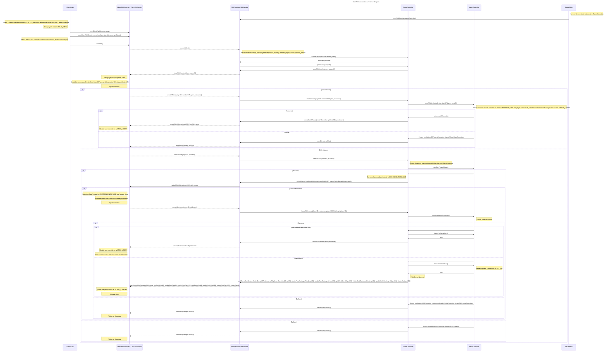
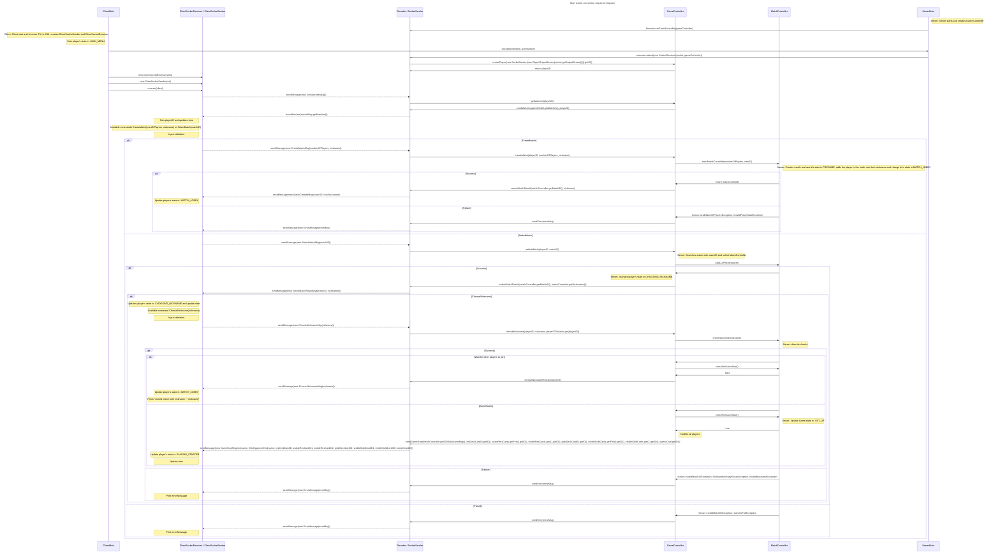
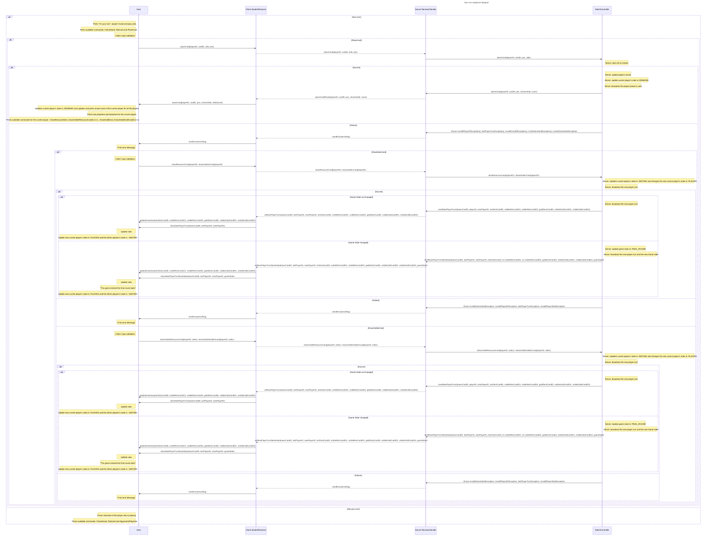
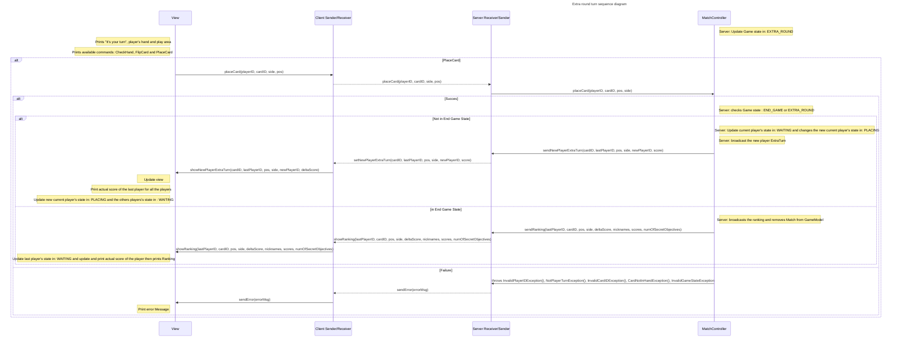

# Sequence Diagram

Start RMI connection sequence diagram

```mermaid
sequenceDiagram
    title Start RMI connection sequence diagram

    participant C as ClientMain
    participant Cn as ClientRMIReceiver / ClientRMISender
    participant D as RMIReceiver/ RMISender
    participant G as GameController
    participant M as MatchController
    participant S as ServerMain
    
    Note right of S: Server: Server starts and creates Game Controller
    S->>D : new RMIReceiver(gameController)

    Note left of C: Client: Client starts and chooses TUI or GUI, creates ClientRMIReceiver and then ClientRMISender
   
    Note left of C: Sets player's state in: MAIN_MENU
    C->>Cn: new ClientRMIReceiver(view)
    C->>Cn: new ClientRMISender(serverInterface, clientReceiver.getClient())
    Note left of C: Client: If there is a failure thows RemoteException, NotBoundException
    
    C->>Cn: connect()

    Cn-->>D: connect(client)

    Note right of D: new RMISender(client), new PlayerModel(newID, sender) and sets player's state in MAIN_MENU
    D->>G: createPlayer(new RMISender(client))
    G->>D: return playerModel

    D->>G: getMatches(playerID)

    G->>D : sendMatches(matches, playerID) 
    D-->>Cn : showMatches(matches, playerID)

    Note left of Cn: Sets playerID and updates view 
    Note left of Cn: Available commands CreateMatch(numOfPlayers, nickname) or SelectMatch(matchID)
    Note left of Cn: Input validation

    alt CreateMatch

        Cn-->>D: createMatch(playerID, numberOfPlayers, nickname)

        D->>G: createMatch(playerID, numberOfPlayers, nickname)
        G->>M: new MatchController(numberOfPlayers, newID)
        Note right of M: Server: Creates match and sets it's state in PREGAME, adds the player to the math, sets he's nickname and change he's state in MATCH_LOBBY


        alt Success
        M->>G : return matchController
        G->>D: createMatchResult(matchController.getMatchID(), nickname)
        D-->>Cn: createMatchResult(matchID, hostNickname)
        Note left of Cn: Update player's state in: MATCH_LOBBY

        else Failure
        M->>G : throws InvalidNumOfPlayersException, InvalidPlayerStateException
        G->>D: sendError(errorMsg)
        D-->>Cn: sendError(String errorMsg)
    
    end

    else SelectMatch

        Cn-->>D: selectMatch(playerID, matchID)
        D->>G : selectMatch(playerID, matchID)

        Note right of G: Server: Searches match with matchID and select MatchController

        G->>M : addCurrPlayer(player)
        
        alt Success
        M->>G : 
        Note left of G: Server: changes player's state in CHOOSING_NICKNAME

        G->>D: selectMatchResult(matchController.getMatchID(), matchController.getNicknames())
        D->>Cn: selectMatchResult(matchID, nicknames)

        alt ChooseNickname
        Note left of Cn: Updates player's state in: CHOOSING_NICKNAME and update view
        Note left of Cn: Available command ChooseNickname(nickname)
        Note left of Cn: Input validation

        Cn-->>D: chooseNickname(playerID, nickname)

        D->>G: chooseNickname(playerID, nickname, playerIDToMatch.get(playerID))
        G->>M: checkNickname(nickname)
        Note right of M: Server: does its checks    
    
        alt Success
        alt Wait for other players to join
            M->>G: 
            G->>M: checkForGameStart()
            M->>G: false
            G->>D: chooseNicknameResult(nickname)
            D-->>Cn : chooseNicknameResult(nickname)
            Note left of Cn: Update player's state in: MATCH_LOBBY
            Note left of Cn: Prints "Joined match with nickname: + nickname"
        else GameStarts
            M->>G: 
            G->>M: checkForGameStart()
            Note right of M: Server: Update Game state in: SET_UP
            M->>G: true
            Note right of G: Notifies all players
            G->>D: sendGameStart(matchController.getIDToNicknameMap(), resDeckCardID.getID(), visibleResCards.getFirst().getID(), visibleResCards.get(1).getID(), goldDeckCardID.getID(), visibleGoldCards.getFirst().getID(), visibleGoldCards.get(1).getID(), starterCard.getID())
            D-->>Cn: startGame(IDtoOpponentNickname, resDeckCardID, visibleResCardID1, visibleResCardID2, goldDeckCardID, visibleGoldCardID1, visibleGoldCardID2, starterCardID)
            
            Note left of Cn: Update player's state in: PLACING_STARTER
            Note left of Cn: Update view
        end

        else Failure
        M->>G: throws InvalidMatchIDException, NicknameAlreadyExistsException, InvalidNicknameException
        G->>D: sendError(errorMsg)
        D-->>Cn: sendError(String errorMsg)
        Note left of Cn: Print error Message 
        end
        end

    else Failure
    M->>G : throws InvalidMatchIDException, GameIsFullException
    G->>D: sendError(errorMsg)
    D-->>Cn: sendError(String errorMsg)
    Note left of Cn: Print error Message

    end

    end
```
Start socket connection sequence diagram

```mermaid
sequenceDiagram
    title Start socket connection sequence diagram

    participant C as ClientMain
    participant Cn as ClientSocketReceiver / ClientSocketSender
    participant D as Decoder / SocketSender
    participant G as GameController
    participant M as MatchController
    participant S as ServerMain


    Note right of S: Server: Server starts and creates Game Controller
    S->>D : Decoder.setGameController(gameController)

    Note left of C: Client: Client start and chooses TUI or GUI, creates ClientSocketSender and ClientSocketReceiver
    Note left of C: Sets player's state in: MAIN_MENU

    C->>S  : Socket(hostName, portNumber)
    S->>D : executor.submit(new SocketReceiver(socket, gameController))
    D->>G : createPlayer(new SocketSender(new ObjectOutputStream(socket.getOutputStream()))).getID()
    G->>D : return playerID


    C->>Cn : new ClientSocketReceiver(view)
    C->>Cn : new ClientSocketSender(out)

    C->>Cn: connect(client)

    Cn-->>D: sendMessage(new GetMatchesMsg());

    D->>G: getMatches(playerID)

    G->>D : sendMatches(gameModel.getMatches(), playerID)
    D-->>Cn : showMatches(castedMsg.getMatches())

    Note left of Cn: Sets playerID and updates view 
    Note left of Cn: Available commands CreateMatch(numOfPlayers, nickname) or SelectMatch(matchID)
    Note left of Cn: Input validation

    alt CreateMatch

        Cn-->>D: sendMessage(new CreateMatchMsg(numberOfPlayers, nickname))

        D->>G: createMatch(playerID, numberOfPlayers, nickname)
        G->>M: new MatchController(numberOfPlayers, newID)
        Note right of M: Server: Creates match and sets it's state in PREGAME, adds the player to the math, sets he's nickname and change he's state in MATCH_LOBBY


        alt Success
        M->>G : return matchController
        G->>D: createMatchResult(matchController.getMatchID(), nickname)
        D-->>Cn: sendMessage(new MatchCreatedMsg(matchID, hostNickname));
        Note left of Cn: Update player's state in: MATCH_LOBBY

        else Failure
        M->>G : throws InvalidNumOfPlayersException, InvalidPlayerStateException
        G->>D: sendError(errorMsg)
        D-->>Cn: sendMessage(new ErrorMessage(errorMsg))
    
    end

    else SelectMatch

        Cn-->>D: sendMessage(new SelectMatchMsg(matchID))
        D->>G : selectMatch(playerID, matchID)

        Note right of G: Server: Searches match with matchID and select MatchController

        G->>M : addCurrPlayer(player)
        
        alt Success
        M->>G : 
        Note left of G: Server: changes player's state in CHOOSING_NICKNAME

        G->>D: selectMatchResult(matchController.getMatchID(), matchController.getNicknames())
        D->>Cn: sendMessage(new SelectMatchResultMsg(matchID, nicknames))

        alt ChooseNickname
        Note left of Cn: Updates player's state in: CHOOSING_NICKNAME and update view
        Note left of Cn: Available command ChooseNickname(nickname)
        Note left of Cn: Input validation

        Cn-->>D: sendMessage(new ChooseNicknameMsg(nickname))

        D->>G: chooseNickname(playerID, nickname, playerIDToMatch.get(playerID))
        G->>M: checkNickname(nickname)
        Note right of M: Server: does its checks    
    
        alt Success
        alt Wait for other players to join
            M->>G: 
            G->>M: checkForGameStart()
            M->>G: false
            G->>D: chooseNicknameResult(nickname)
            D-->>Cn : sendMessage(new ChosenNicknameMsg(nickname))
            Note left of Cn: Update player's state in: MATCH_LOBBY
            Note left of Cn: Prints "Joined match with nickname: + nickname"
        else GameStarts
            M->>G: 
            G->>M: checkForGameStart()
            Note right of M: Server: Update Game state in: SET_UP
            M->>G: true
            Note right of G: Notifies all players
            G->>D: sendGameStart(matchController.getIDToNicknameMap(), resDeckCardID.getID(), visibleResCards.getFirst().getID(), visibleResCards.get(1).getID(), goldDeckCardID.getID(), visibleGoldCards.getFirst().getID(), visibleGoldCards.get(1).getID(), starterCard.getID())
            D-->>Cn: sendMessage(new GameStartMsg(nickname, IDtoOpponentNickname, resDeckCardID, visibleResCardID1, visibleResCardID2, goldDeckCardID, visibleGoldCardID1, visibleGoldCardID2, starterCardID));
            
            Note left of Cn: Update player's state in: PLACING_STARTER
            Note left of Cn: Update view
        end

        else Failure
        M->>G: throws InvalidMatchIDException, NicknameAlreadyExistsException, InvalidNicknameException
        G->>D: sendError(errorMsg)
        D-->>Cn: sendMessage(new ErrorMessage(errorMsg))
        Note left of Cn: Print error Message 
        end
        end

    else Failure
    M->>G : throws InvalidMatchIDException, GameIsFullException
    G->>D: sendError(errorMsg)
    D-->>Cn: sendMessage(new ErrorMessage(errorMsg))
    Note left of Cn: Print error Message

    end

    end
```

Game setup sequence diagram

```mermaid
sequenceDiagram
    title Game setup sequence diagram

    participant V as View
    participant Cn as Client Sender/Receiver
    participant Sn as Server Receiver/Sender
    participant M as MatchController
    participant G as GameController
    
    Note right of G: Server: All players connected
    Note right of G: Server: notifies all players
    
    G->>Sn : sendGameStart(IDtoOpponentNickname, resDeckCardID, visibleResCardID1, visibleResCardID2, goldDeckCardID, visibleGoldCardID1, visibleGoldCardID2, starterCardID)

    Sn-->>Cn: startGame(IDtoOpponentNickname, resDeckCardID, visibleResCardID1, visibleResCardID2, goldDeckCardID, visibleGoldCardID1, visibleGoldCardID2, starterCardID)
    
    Cn->>V: startGame(IDtoNicknameMap, resDeckCardID, visibleResCardID1, visibleResCardID2, goldDeckCardID, visibleGoldCardID1, visibleGoldCardID2, starterCardID)
    
    Note left of V: Print DrawArea and StarterCard and update player State in PLACING_STARTER
    Note left of V: Available commands : FlipStarterCard or PlaceStarterCard on the current side
    Note left of V: Input validation

    alt PlaceStarterCard
    V->>Cn : placeStarterCard(playerID, side);
    Cn-->>Sn : placeStarterCard(playerID, side)
    Sn->>M: placeStarterCardForPlayer(playerID, side)
    Note right of M: Server: sets Player's Token and updates player's state in: CHOOSING_OBJECTIVE
    alt Success

    M->>Sn : sendMissingSetup(resourceCardID1, resourceCardID2, goldenCardID, tokenColor, commonObjectiveCardID1, commonObjectiveCardID2, secretObjectiveCardID1, secretObjectiveCardID2)
    Sn-->>Cn : setMissingSetup(resourceCardID1, resourceCardID2, goldenCardID, tokenColor, commonObjectiveCardID1, commonObjectiveCardID2, secretObjectiveCardID1, secretObjectiveCardID2)
    Cn->>V : setMissingSetUp(resourceCardID1, resourceCardID2, goldenCardID, tokenColor, commonObjectiveCardID1, commonObjectiveCardID2, secretObjectiveCardID1, secretObjectiveCardID2)
    Note left of V: Update player's state in: CHOOSING_OBJECTIVE
    Note left of V: Update view
    Note left of V: Prints common objectives and the secret objective to choose
    else Failure
    M->>Sn : throws InvalidPlayerIDException, InvalidGameStateException , NotEnoughCardsException
    Sn-->>Cn : sendError(errorMsg)
    Cn->>V : sendError(errorMsg)
    Note left of V: Prints error Message
    end
    end

    Note left of V: Avaiable command: ChooseSecretObjective(1 or 2)

    Note left of V: Input validation

    alt ChooseSecretObjective

    V->>Cn : chooseSecretObjective(playerID, secretObjectiveCardID)
    Cn-->>Sn : chooseSecretObj(playerID, cardID)
    Sn->>M: setSecretObjectiveForPlayer(playerID, cardID)
    alt Success
    Note right of S: Server: Updates player's state in: COMPLETED_SETUP

    alt Wait for all players
    M->>Sn : confirmSecretObjective()
    Sn-->>Cn : confirmSecretObjective()
    Cn->>V : confirmSecretObjective()
    Note left of V: Update player's state in: COMPLETED_SETUP
    Note left of V: "Waiting for other players to end their setup"
    else All players are ready

    Note right of M: Server: Update player's state in: COMPLETED_SETUP
    Note right of M: Server: Update firts player's state in: PLAYING and the others player's state in WAITING
    Note right of M: Server: Sends FirstPlayerTurn to all the players
    
    M->>Sn : sendFirstPlayerTurn(lastPlayerID, playerID, playerIDs, starterCardIDs, starterCardSides, tokenColors, playerHands, resDeckCardID, visibleResCardID1, visibleResCardID2, goldDeckCardID, visibleGoldCardID1, visibleGoldCardID2)
    Sn-->>Cn : sendFirstPlayerTurn(lastPlayerID, playerID, playerIDs, starterCardIDs, starterCardSides, tokenColors, playerHands, resDeckCardID, visibleResCardID1, visibleResCardID2, goldDeckCardID, visibleGoldCardID1, visibleGoldCardID2)
    Cn->>V : updateDrawArea(resDeckCardID, visibleResCardID1, visibleResCardID2, goldDeckCardID, visibleGoldCardID1, visibleGoldCardID2)
    Note left of V: Print draw area for all the players
    Cn->>V : showFirstPlayerTurn( lastPlayerID, playerID, playerIDs, starterCardIDs, starterCardSides, tokenColors, playerHands)
    Note left of V: Update player's state in: PLACING if he is the first player, WAITING if he is not
    Note left of V: Prints chat commands
    end

    else Failure
    M->>Sn : throws InvalidPlayerIDException | InvalidObjectiveCardIDException | StarterCardNotSetException
    Sn-->>Cn : sendError(errorMsg)
    Cn->>V : sendError(errorMsg)
    Note left of V: Prints error Message
    end
    end
```
Your turn sequence diagram

```mermaid
sequenceDiagram
    title Your turn sequence diagram

    participant V as View
    participant Cn as Client Sender/Receiver
    participant Sn as Server Receiver/Sender
    participant M as MatchController
    alt Your turn

    Note left of V: Prints "It's your turn", player's hand and play area
    Note left of V: Prints available commands: CheckHand, FlipCard and PlaceCard
    Note left of V: Client: Input validation

    alt PlaceCard

    V->>Cn : placeCard(playerID, cardID, side, pos)
    Cn-->>Sn : placeCard(playerID, cardID, side, pos)
    Sn->>M: placeCard(playerID, cardID, pos, side)
    Note right of M: Server: does all its checks

    alt Succes
    Note right of M: Server: update player's Score
    Note right of M: Server: update current player's state in DRAWING
    
    Note right of M: Server: broadcast the player placed a card
    M->>Sn: placeCard(playerID, cardID, pos, chosenSide, score)
    Sn-->>Cn: placeCardResult(playerID, cardID, pos, chosenSide, score)
    Cn->>V: placeCard(playerID, cardID, pos, chosenSide, deltaScore)
    Note left of V: Updates current player's state in: DRAWING and updates and prints actual score of the current player for all the players
    Note left of V: Prints new playArea and drawArea for the current player
    Note left of V: Prints available commands for the current player : DrawResourceDeck, DrawVisibleResourceCard(0 or 1) , DrawGoldDeck, DrawVisibleGoldCard(0 or 1)

    else Failure
    M->>Sn: throws InvalidPlayerIDException(), NotPlayerTurnException(), InvalidCardIDException(), CardNotInHandException(), InvalidGameStateException
    Sn-->>Cn: sendError(errorMsg)
    Cn->>V: sendError(errorMsg)
    Note left of V: Print error Message

    alt DrawDeckCard
    Note left of V: Client: Input validation

    V->>Cn : drawResourceCard(playerID) / drawGoldenCard(playerID)
    Cn-->>Sn : drawResourceCard(playerID) / drawGoldenCard(playerID)
    Sn->>M : drawResourceCard(playerID) / drawGoldenCard(playerID)

    Note right of M: Server: Updates current player's state in:  WAITING and changes the new current player's state in: PLACING 
    Note right of M: Server: broadcast the new player turn
    alt Succes

    alt Game State not changed
    Note right of M: Server: broadcast the new player turn
    M->>Sn: sendNewPlayerTurn(drawnCardID, playerID, newPlayerID, resDeckCardID, visibleResCardID1, visibleResCardID2, goldDeckCardID, visibleGoldCardID1, visibleGoldCardID2)
    Sn-->>Cn: setNewPlayerTurn(drawnCardID, lastPlayerID, newPlayerID, resDeckCardID, visibleResCardID1, visibleResCardID2, goldDeckCardID, visibleGoldCardID1, visibleGoldCardID2)
    Cn->>V: updateDrawArea(resDeckCardID, visibleResCardID1, visibleResCardID2, goldDeckCardID, visibleGoldCardID1, visibleGoldCardID2)
    Cn->>V: showNewPlayerTurn(drawnCardID, lastPlayerID, newPlayerID)
    Note left of V: Update view
    Note left of V: Update new current player's state in: PLACING and the others players's state in : WAITING

    else Game State changed
    Note right of M: Server: Update game state in: FINAL_ROUND
    Note right of M: Server: broadcast the new player turn and the new Game state
    M->>Sn: sendNewPlayerTurnNewState(drawnCardID, lastPlayerID, newPlayerID, resDeckCardID, int visibleResCardID1, int visibleResCardID2, goldDeckCardID, visibleGoldCardID1, visibleGoldCardID2, gameState)
    Sn-->>Cn: setNewPlayerTurnNewState(drawnCardID, lastPlayerID, newPlayerID, resDeckCardID, visibleResCardID1, visibleResCardID2, goldDeckCardID, visibleGoldCardID1, visibleGoldCardID2, gameState)
    Cn->>V: updateDrawArea(resDeckCardID, visibleResCardID1, visibleResCardID2, goldDeckCardID, visibleGoldCardID1, visibleGoldCardID2)
    Cn->>V: showNewPlayerTurnNewState(drawnCardID, lastPlayerID, newPlayerID, gameState)
    Note left of V: Update view
    Note left of V: "The game entered the final round state."
    Note left of V: Update new current player's state in: PLACING and the others players's state in : WAITING

    end
    else Failure
    M->>Sn: throws InvalidGameStateException, InvalidPlayerIDException, NotPlayerTurnException, InvalidPlayerStateException
    Sn-->>Cn: sendError(errorMsg)
    Cn->>V: sendError(errorMsg)
    Note left of V: Print error Message

    else DrawVisibleCard
    Note left of V: Client: Input validation

    V->>Cn : drawVisibleResourceCard(playerID, index) / drawVisibleGoldenCard(playerID, index)
    Cn-->>Sn : drawVisibleResourceCard(playerID, index) / drawVisibleGoldenCard(playerID, index)
    Sn->>M : drawVisibleResourceCard(playerID, index) / drawVisibleGoldenCard(playerID, index)

    Note right of M: Server: Updates current player's state in:  WAITING and changes the new current player's state in: PLACING 
    Note right of M: Server: broadcast the new player turn
    alt Succes
    alt Game State not changed
    Note right of M: Server: broadcast the new player turn
    M->>Sn: sendNewPlayerTurn(drawnCardID, playerID, newPlayerID, resDeckCardID, visibleResCardID1, visibleResCardID2, goldDeckCardID, visibleGoldCardID1, visibleGoldCardID2)
    Sn-->>Cn: setNewPlayerTurn(drawnCardID, lastPlayerID, newPlayerID, resDeckCardID, visibleResCardID1, visibleResCardID2, goldDeckCardID, visibleGoldCardID1, visibleGoldCardID2)
    Cn->>V: updateDrawArea(resDeckCardID, visibleResCardID1, visibleResCardID2, goldDeckCardID, visibleGoldCardID1, visibleGoldCardID2)
    Cn->>V: showNewPlayerTurn(drawnCardID, lastPlayerID, newPlayerID)

    Note left of V: Update view
    Note left of V: Update new current player's state in: PLACING and the others players's state in : WAITING

    else Game State changed
    Note right of M: Server: Update game state in: FINAL_ROUND
    Note right of M: Server: broadcast the new player turn and the new Game state
    M->>Sn: sendNewPlayerTurnNewState(drawnCardID, lastPlayerID, newPlayerID, resDeckCardID, int visibleResCardID1, int visibleResCardID2, goldDeckCardID, visibleGoldCardID1, visibleGoldCardID2, gameState)
    Sn-->>Cn: setNewPlayerTurnNewState(drawnCardID, lastPlayerID, newPlayerID, resDeckCardID, visibleResCardID1, visibleResCardID2, goldDeckCardID, visibleGoldCardID1, visibleGoldCardID2, gameState)
    Cn->>V: updateDrawArea(resDeckCardID, visibleResCardID1, visibleResCardID2, goldDeckCardID, visibleGoldCardID1, visibleGoldCardID2)
    Cn->>V: showNewPlayerTurnNewState(drawnCardID, lastPlayerID, newPlayerID, gameState)
    Note left of V: Update view
    Note left of V: "The game entered the final round state."
    Note left of V: Update new current player's state in: PLACING and the others players's state in : WAITING


    end
    else Failure
    M->>Sn: throws InvalidGameStateException, InvalidPlayerIDException, NotPlayerTurnException, InvalidPlayerStateException
    Sn-->>Cn: sendError(errorMsg)
    Cn->>V: sendError(errorMsg)
    Note left of V: Print error Message
    end

    end
    end
    end
    end

    else Not your turn
    Note left of V: Prints nickname of the player who is placing 
    Note left of V: Prints available commands: CheckHand, FlipCard and OpponentsPlayArea

    end
```
Extra round turn sequence diagram

```mermaid
sequenceDiagram
    title Extra round turn sequence diagram

    participant V as View
    participant Cn as Client Sender/Receiver
    participant Sn as Server Receiver/Sender
    participant M as MatchController
 
    Note right of M: Server: Update Game state in: EXTRA_ROUND
    Note left of V: Prints "It's your turn", player's hand and play area
    Note left of V: Prints available commands: CheckHand, FlipCard and PlaceCard
    alt PlaceCard
    V->>Cn : placeCard(playerID, cardID, side, pos)
    Cn-->>Sn : placeCard(playerID, cardID, side, pos)
    Sn->>M: placeCard(playerID, cardID, pos, side)
    alt Succes
    Note right of M: Server: checks Game state : END_GAME or EXTRA_ROUND
    
    alt Not in End Game State
    Note right of M: Server: Update current player's state in:  WAITING and changes the new current player's state in: PLACING 
    Note right of M: Server: broadcast the new player ExtraTurn
    M->>Sn: sendNewPlayerExtraTurn(cardID, lastPlayerID, pos, side, newPlayerID, score)
    Sn-->>Cn: setNewPlayerExtraTurn(cardID, lastPlayerID, pos, side, newPlayerID, score)
    Cn->>V: showNewPlayerExtraTurn(cardID, lastPlayerID, pos, side, newPlayerID, deltaScore)
    Note left of V: Update view
    Note left of V: Print actual score of the last player for all the players
    Note left of V: Update new current player's state in: PLACING and the others players's state in : WAITING

    else in End Game State
    Note right of M: Server: broadcasts the ranking and removes Match from GameModel

    M->>Sn: sendRanking(lastPlayerID, cardID, pos, side, deltaScore, nicknames, scores, numOfSecretObjectives)
    Sn-->>Cn: showRanking(lastPlayerID, cardID, pos, side, deltaScore, nicknames, scores, numOfSecretObjectives)
    Cn->>V: showRanking(lastPlayerID, cardID, pos, side, deltaScore, nicknames, scores, numOfSecretObjectives)
    Note left of V: Update last player's state in: WAITING and update and print actual score of the player then prints Ranking
    
    end

    else Failure
    M->>Sn: throws InvalidPlayerIDException(), NotPlayerTurnException(), InvalidCardIDException(), CardNotInHandException(), InvalidGameStateException
    Sn-->>Cn: sendError(errorMsg)
    Cn->>V: sendError(errorMsg)
    Note left of V: Print error Message

    end
    end
```
