# UML
UML generale
```mermaid
classDiagram
    
    class PlaceableCard {
        <<Abstract>>
    - String cardType
    - int ID
    - CardElementType elementType
    - int priority
    - CardSideType currSide
    - Side front
    - Side back
    + void setCardType(String cardType)
    + int getID()
    + CardElementType getElementType()
    + void setPriority(int newPriority)
    + int getPriority()
    + CardSideType getCurrSideType()
    + Side getSideFromType(CardSideType sideType)
    + Side getCurrSide()
    + void setCurrSideType(CardSideType newSide)
    + Side getFront()
    + Side getBack()
    + List~ResourceType~ getResources(Side chosenSide)
    + boolean hasEnoughRequiredResources(int[] numOfResourcesArr, CardSideType chosenSide)
    + int calculatePlacementPoints(int numOfCoveredCorners, int[] numOfResourcesArr, CardSideType chosenSide)

    }

    PlaceableCard <|-- ResourceCard
    PlaceableCard <|-- GoldenCard
    PlaceableCard <|-- StarterCard

    PlaceableCard "1" *-- "1" CardElementType
    PlaceableCard "1" *-- "1" Side 
    PlaceableCard "1" *-- "1" CardSideType

    UsableCardsDeck "1" *-- "*" PlaceableCard
    StarterCardsDeck "1" *-- "*" PlaceableCard

    class StarterCard {
      
    }
    class GoldenCard {
      - int pointsPerResource
      - int pointsPerCoveredCorner
      - boolean isPointPerResource
      - ResourceType pointPerResourceRes
      - HashMap~ResourceType, Integer~ requiredResources
      - int points

      + int getPoints()
      + ResourceType getPointPerResourceRes()
      + HashMap~ResourceType, Integer~ getRequiredResources()
      + boolean isPointPerResource()
    }

    GoldenCard "1" *-- "*" ResourceType

    class ResourceCard {
      - int points
      + int getPoints()
    }
    class ObjectiveCard {
        <<Abstract>>
        - int id
        - int points
        - String objectiveType

        + int getID()
        + int getPoints()
        + void setObjectiveType(String objectiveType)
        + int calculateObjectivePoints(HashMap~Position, PlaceableCard~ playArea, int[] numOfResourcesArr)

    }
    
    ObjectiveCard <|-- TrinityObjectiveCard
    ObjectiveCard <|-- LShapeObjectiveCard
    ObjectiveCard <|-- DiagonalObjectiveCard
    ObjectiveCard <|-- ResourcesCountObjectiveCard

    ObjectiveCardsDeck "1" *-- "*" ObjectiveCard

    class ResourcesCountObjectiveCard {
        - int points
        - ResourceType resourceType
        - int requiredResourceCount

        + ResourceType getResourceType()
    }
    ResourcesCountObjectiveCard "1" *-- "1" ResourceType

    class TrinityObjectiveCard {
        - int points

    }
    class LShapeObjectiveCard {
        <<Abstract>>
        - int points
        - CardElementType mainElementType
        - CardElementType secondaryElementType

        + CardElementType getMainElementType()
        + CardElementType getSecondaryElementType()
        # int calculateObjectivePoints(HashMap~Position, PlaceableCard~ playArea, int xDirection, int yDirection)
    }

    LShapeObjectiveCard <|-- BRLShapeObjectiveCard
    LShapeObjectiveCard <|-- TLLShapeObjectiveCard
    LShapeObjectiveCard <|-- BLLShapeObjectiveCard
    LShapeObjectiveCard <|-- TRLShapeObjectiveCard

    LShapeObjectiveCard "1" *-- "1" CardElementType

    class BRLShapeObjectiveCard {
        - int xDirection
        - int yDirection
    }
    class TLLShapeObjectiveCard {
        - int xDirection
        - int yDirection
    }
    class BLLShapeObjectiveCard {
        - int xDirection
        - int yDirection
    }
    class TRLShapeObjectiveCard {
        - int xDirection
        - int yDirection
    }
    class DiagonalObjectiveCard {
        <<Abstract>>
        - int points
        - CardElementType elementType

        + CardElementType getElementType()
        # int calculateObjectivePoints(HashMap~Position, PlaceableCard~ playArea, int direction)
    }

    DiagonalObjectiveCard <|-- TRBLDiagonalObjectiveCard
    DiagonalObjectiveCard <|-- TLBRDiagonalObjectiveCard
    DiagonalObjectiveCard "1" *-- "1" CardElementType

    class TRBLDiagonalObjectiveCard {
        - int direction
    }
    class TLBRDiagonalObjectiveCard {
        - int direction
    }

    class ObjectiveCardsDeck {
       - List~ObjectiveCard~ deck
       - List~ObjectiveCard~ commonObjectives

       + List~ObjectiveCard~ getDeck()
       + List~ObjectiveCard~ getCommonObjectives()
       + void shuffleDeck()
       + ObjectiveCard drawCard()
       + setCommonObjectives()
    }
    
    class UsableCardsDeck {
        - List~PlaceableCard~ deck
        - List~PlaceableCard~ visibleCards

        + List~PlaceableCard~ getDeck()
        + List~PlaceableCard~ getVisibleCards()
        + void shuffleDeck()
        + void restoreInitialVisibleCards ()
        + PlaceableCard drawCard()
        + PlaceableCard drawVisibleCard(int index)
        + void restoreVisibleCard()
        + void restoreVisibleCardWithOtherDeck(PlaceableCard card)
        + boolean isDeckEmpty()
    }
    class StarterCardsDeck{
       <<Record>>

        + List~PlaceableCard~ deck()
        + void shuffleDeck()
        + PlaceableCard drawCard()
    }
    class Position {
       <<Record>>

        + int X()
        + int Y()

    }
    class CardElementType {
        <<Enumeration>>
        STARTER("S", CC.YELLOW, CC.YELLOW_BG)
        ANIMAL("A", CC.BLUE, CC.BLUE_BG)
        PLANT("P", CC.GREEN, CC.GREEN_BG)
        FUNGI("F", CC.RED, CC.RED_BG)
        INSECT("I", CC.PURPLE, CC.PURPLE_BG)

        - String str
        - String color
        - String bgColor

        + String getColor()
        + String getBgColor()
        + CardElementType cardElementTypeFromString(String cardElementType)
    }
    class Side {
        <<Abstract>>
        - String sideType;
        - CardCorner BLCorner
        - CardCorner BRCorner
        - CardCorner TLCorner
        - CardCorner TRCorner

        + CardCorner getBLCorner()
        + CardCorner getBRCorner()
        + CardCorner getTLCorner()
        + CardCorner getTRCorner()
        + List~ResourceType~ getResources()
    }

    Side <|-- Front
    Side <|-- Back
    Side "1" *-- "1" CardCorner

    class Front {

    }
    class Back {
        - List~ResourceType~ permanentResources
    }

    Back "1" *-- "*" ResourceType

    class CardSideType {
        <<Enumeration>>
        FRONT
        BACK
    }
    class ResourceType {
        <<Enumeration>>
        ANIMAL(0, "A", CC.BLUE)
        PLANT(1, "P", CC.GREEN)
        FUNGI(2, "F", CC.RED)
        INSECT(3, "I", CC.PURPLE)
        QUILL(4, "Q", CC.YELLOW)
        INKWELL(5, "K", CC.YELLOW)
        MANUSCRIPT(6, "M", CC.YELLOW)

        - int value
        - String str
        - String color

        + int getValue()
        + String getColor()
        + ResourceType resourceTypeFromString(String str)
    }
    
    class CardCorner {
        <<Abstract>>
        - String cornerType

        + boolean isAvailable()
        + ResourceType getResource()
    }

    CardCorner <|-- HiddenCorner
    CardCorner <|-- VisibleCorner

    class HiddenCorner {

    }
    class VisibleCorner {
        <<Abstract>>
    }
    
    VisibleCorner <|-- EmptyCorner
    VisibleCorner <|-- ResourceCorner

    class EmptyCorner {

    }
    class ResourceCorner {
        - ResourceType resourceType
    }
    ResourceCorner "1" *-- "1" ResourceType


class GameState {
    <<Enumeration>>
    PREGAME
    SET_UP
    PLAYING
    FINAL_ROUND
    EXTRA_ROUND
    END_GAME
    
    }

    class MatchModel {
    - int maxPlayers
    - int currPlayers
    - int playersReady
    - int matchID

    - HashMap~Integer, PlayerModel~ IDToPlayerMap

    - UsableCardsDeck resourceCardsDeck
    - UsableCardsDeck goldenCardsDeck
    - ObjectiveCardsDeck objectiveCardsDeck
    - StarterCardsDeck starterCardsDeck

    - int currPlayerID

    - int firstPlayerID
    - int[] orderOfPlayersIDs

    - GameState gameState
    - List~TokenColors~ tokenColors

    - String[] nicknamesRanked
    - int[] scoresRanked
    - int[] numOfCompletedObjectivesRanked
    - Timer timer
    - TimerTask announceSoleWinner
    - int SOLE_WINNER_ANNOUNCE_DELAY

    + void setGameState(GameState gameState)
    + void addHost(PlayerModel playerModel)
    + void addReadyPlayer()
    + void addCurrPlayer(PlayerModel playerModel) throws GameIsFullException
    + void initializeDecks()
    + void shuffleAllDecks()
    + void setVisibleCards ()

    + PlaceableCard drawResourceCard() throws NotEnoughCardsException
    + PlaceableCard drawGoldenCard() throws NotEnoughCardsException
    + PlaceableCard drawStarterCard()
    + ObjectiveCard drawObjectiveCard()
    + PlaceableCard drawVisibleResourceCard(int index) throws InvalidVisibleCardIndexException
    + PlaceableCard drawVisibleGoldenCard(int index) throws InvalidVisibleCardIndexException
    + void restoreVisibleResourceCard ()
    + void restoreVisibleGoldenCard ()
    + void setRandomFirstPlayer()
    + void calculateOrderOfPlayers()
    + void endTurn()
    + void checkForEndGame()
    + void manageEndGame()
    + void determineRanking()
    + boolean checkForTurnOrderPhase()
    + void startTurnOrderPhase()
    + void checkNickname(String nickname) throws NicknameAlreadyExistsException
    + Map~Integer, String~ getIDtoNicknameMap()
    + void removePlayer(int playerID)
    + int reconnectPlayer(String nickname, Sender newSender) throws SpecifiedPlayerNotDisconnected, NicknameNotInMatch
    + boolean hasNoPlayers()
    + boolean hasNoPlayersOnline()
    + void undoCardPlacement(int playerID)
    + boolean checkForLastPlayerStanding()
    + boolean isOver()
    - void stopPinging(PlayerModel player)
    - void reconnect(PlayerModel player)
    - void reconnectOnObjectiveChoice(PlayerModel player)
    - void reconnectOnStarterPlacement(PlayerModel player)
    - void reconnectPlayerAfterSetup(PlayerModel player)
    }
    
    MatchModel "1" *-- "1" GameState


    class MatchController {
    - MatchModel matchModel

    + Sender getPlayerSender(int playerID)
    + Map~Integer, PlayerModel~ getIDToPlayerMap()
    + Map~Integer, String~ getIDToNicknameMap()
    + int getMatchID()
    + List~String~ getNicknames()

    + void addHost(PlayerModel host)

    + boolean checkForGameStart()
    + void setUpGame()
    + void initializeDecks()
    + void shuffleAllDecks()
    + void setVisibleCards()


    + PlaceableCard checkFirstResDeckCard()
    + PlaceableCard checkFirstGoldDeckCard()
    + void placeStarterCardForPlayer(int playerID, CardSideType side)
    + void setSecretObjectiveForPlayer(int playerID, int cardID)
    + void setCommonObjectives()

    + List~Integer~ setObjectivesToChoose(int playerID) throws InvalidPlayerIDException
    + TokenColors setPlayerToken(int playerID) throws InvalidPlayerIDException
    
    + List~Integer~ getCommonObjectivesID()
    + void setRandomFirstPlayer()
    + void calculateOrderOfPlayers()

    + void placeCard(int playerID, int cardID, Position pos, CardSideType chosenSide)
    + List~Integer~ fillPlayerHand(int playerID) throws InvalidGameStateException, InvalidPlayerIDException, NotEnoughCardsException
    + boolean checkForTurnOrderPhase()
    + int getCurrPlayerID()

    + PlaceableCard drawStarterCard()
    + void drawResourceCard(int playerID)
    + void drawVisibleResourceCard(int playerID, int index)
    + void drawGoldenCard(int playerID)
    + void drawVisibleGoldenCard(int playerID, int index)

    + void endGameSetUp()
    + void endTurn()

    - void checkPlayerDrawExceptions(int playerID) throws InvalidGameStateException, InvalidPlayerIDException, NotPlayerTurnException, InvalidPlayerStateException
    + void checkNickname(String nickname) throws NicknameAlreadyExistsException
    + void addReadyPlayer()
    + void addCurrPlayer(PlayerModel player)

    + void disconnectPlayer(int playerID)
    + int reconnectPlayer(String nickname, Sender newSender) throws SpecifiedPlayerNotDisconnected, NicknameNotInMatch
    + void chatMessage(int senderID, String recipient, String message)
    - void broadcastNewPlayerTurn(int drawnCardID, int playerID, boolean changedState)
    - void broadcastNewPlayerExtraTurn(int playerID, int cardID, Position pos, CardSideType side, int score)
    - void broadcastPlaceCard(int playerID, int cardID, Position pos, CardSideType side, int score)
    - void broadcastRanking(int lastPlayerID, int cardID, Position pos, CardSideType side, int deltaScore, String[] nicknames, int[] scores, int[] numOfSecretObjectives)
    - void broadcastPlayerDisconnection(int playerID)
    - void broadcastUndoCardPlacement(int playerID, Position pos, int score, int nextPlayerID)
    - void broadcastPlayerReconnection(int playerID)
    
    + boolean hasNoPlayers()
    + boolean hasNoPlayersOnline()
    + boolean isOver()

    }
    
    MatchController "1" *-- "1" MatchModel


    class GameResources {

    - List~PlaceableCard~ resourcesDeck
    - List~PlaceableCard~ goldenDeck
    - List~PlaceableCard~ starterDeck
    - List~ObjectiveCard~ objectiveDeck

    - Map~Integer, PlaceableCard~ IDToPlaceableCardMap
    - Map~Integer, ObjectiveCard~ IDToObjectiveCardMap

    + CardCorner deserializeCorner()
    + Side deserializeFront()
    + Side deserializeBack()
    + PlaceableCard deserializeResourceCard()
    + PlaceableCard deserializeGoldenCard()
    + PlaceableCard deserializeStarterCard()
    + ObjectiveCard deserializeObjectiveCard()

    + void initializeResourceDeck()
    + void initializeGoldenDeck()
    + void initializeStarterDeck()
    + void initializeObjectiveDeck()
    + void fillCardMaps()
    + void initializeAllDecks()

    + PlaceableCard getPlaceableCardByID(int ID)
    + ObjectiveCard getObjectiveCardByID(int ID)

    + List~PlaceableCard~ getResourcesDeck()
    + List~PlaceableCard~ getGoldenDeck()
    + List~PlaceableCard~ getStarterDeck()
    + List~ObjectiveCard~ getObjectiveDeck()

    + Map~Integer, PlaceableCard~ getIDToPlaceableCardMap()

    }

    class GameModel {
    - List~MatchController~ matches
    - Map~Integer, PlayerModel~ IDToPlayers

    + Map~Integer, List~String~~ getMatches()
    + Map~Integer, PlayerModel~ getIDToPlayers()
    + MatchController getMatchByID(int matchID)
    + MatchController createGame(int playerID, int numberOfPlayers, String nickname)
    + MatchController selectMatch(int playerID, int matchID)
    + void chooseNickname(int playerID, String nickname)
    + int reconnectToMatch(int playerID, String nickname, int matchID)
    + PlayerModel createPlayer(Sender sender)
    + void startGame(MatchController matchController)
    + void removeMatch(int matchID)
    + boolean containsMatch(MatchController matchController)
    + void removeMatch(MatchController matchController)
    }
    
    GameModel "1" *-- "*" MatchController 

    class GameController {
    - GameModel gameModel

    + MatchController getMatchByID(int matchID) throws InvalidMatchIDException
    + void getMatches(int playerID)
    + MatchController createMatch(int playerID, int numberOfPlayers, String nickname)
    + MatchController selectMatch(int playerID, int matchID) 
    + void chooseNickname(int playerID, String nickname, MatchController matchController)
    + int reconnectToMatch(int playerID, String nickname, int matchID)
    + PlayerModel createPlayer(Sender sender)
    + int getMatchIDWithPlayer(int playerID)
    + Sender getPlayerSender(int playerID)
    + void checkMatchState(MatchController matchController)
    + boolean matchNotPresent(MatchController matchController)

    }

    GameController "1" *-- "1" GameModel

    GameModel "1" *-- "*" PlayerModel

    class PlayerModel {
    - String nickname
    - int ID
    - int matchID
    - List~PlaceableCard~ hand
    - int[] secretObjectiveCardIDs
    - ObjectiveCard secretObjective
    - PlaceableCard starterCard
    - HashMap~Position, PlaceableCard~ playArea
    - int[] numOfResourcesArr

    - Position lastCardPlacedPos
    - int lastScore
    - int[] lastNumOfResources

    - int currScore
    - int numOfCompletedObjectives
    - TokenColors token
    - TokenColors firstPlayerToken
    - PlayerState lastPlayerState
    - PlayerState state
    - Object stateLock
    - int currMaxPriority
    - Sender sender

    + List~PlaceableCard~ getHand()
   
    + void setSecretObjectiveCardIDs(int firstObjectiveCardID, int secondObjectiveCardID) 
    + int[] getSecretObjectiveCardIDs()
    
    + ObjectiveCard getSecretObjective()
    + void setSecretObjective(int cardID) throws InvalidObjectiveCardIDException

    + PlaceableCard getStarterCard() throws StarterCardNotSetException

    + void setStarterCard(PlaceableCard sCard)
    + HashMap~Position, PlaceableCard~ getPlayArea()
    + int[] getNumOfResourcesArr()
    + int getNumOfCompletedObjectives()

    + boolean isFirstPlayer()
    + void setAsFirstPlayer(boolean isFirstPlayer)
    
    + PlayerState getLastPlayerState()
    + int getCurrMaxPriority()
    + void placeStarterCard(CardSideType chosenSide)
    + void placeCard(PlaceableCard card, Position pos, CardSideType chosenSide) throws PositionAlreadyTakenException, MissingResourcesException, NoAdjacentCardsException, PlacingOnInvalidCornerException, InvalidPlayerStateException
    + void calculateObjectivePoints(ObjectiveCard oCard)
    + void drawCard(PlaceableCard card)
    + Position getLastCardPlacedPos()
    + void undoCardPlacement()
    }

    PlayerModel "1" *-- "1" PlayerState
    PlayerModel  *--  TokenColors


    class TokenColors {
        <<Enumeration>>
    NONE
    RED
    BLUE
    GREEN
    YELLOW
    BLACK
    + TokenColors getColorFromInt(int n) 
    + Color getColorFromToken(TokenColors token)
    }
    


    class PlayerState {
        <<Enumeration>>
    MAIN_MENU
    MATCH_LOBBY
    CHOOSING_NICKNAME
    PLACING_STARTER
    CHOOSING_OBJECTIVE
    COMPLETED_SETUP
    WAITING
    PLACING
    DRAWING
    GAME_OVER
    DISCONNECTED
    ALONE
    }

    class PlayerRanker {
    + int compare(PlayerModel p1, PlayerModel p2)
    }
    

    
    class Sender {
        <<Interface>>
    + void sendError(String errorMsg)
    + void sendMatches(Map~Integer, List~String~~ matches, int playerID)
    + void createMatchResult(int matchID, String hostNickname)
    + void selectMatchResult(int matchID, List~String~ nicknames)
    + void chooseNicknameResult(String nickname)
    + void sendGameStart(Map~Integer, String~ IDtoOpponentNickname, int resDeckCardID, int visibleResCardID1, int visibleResCardID2, int goldDeckCardID, int visibleGoldCardID1, int visibleGoldCardID2, int starterCardID)
    + void sendMissingSetup(int resourceCardID1, int resourceCardID2, int goldenCardID, TokenColors tokenColor, int commonObjectiveCardID1, int commonObjectiveCardID2, int secretObjectiveCardID1, int secretObjectiveCardID2)
    + void confirmSecretObjective()
    + void placeCard(int playerID, int cardID, Position pos, CardSideType chosenSide, int score)
    + void sendFirstPlayerTurn(int lastPlayerID, int playerID, int[] playerIDs, int[] starterCardIDs, CardSideType[] starterCardSides, TokenColors[] tokenColors, int[][] playerHands, int resDeckCardID, int visibleResCardID1, int visibleResCardID2, int goldDeckCardID, int visibleGoldCardID1, int visibleGoldCardID2)
    + void sendNewPlayerTurn(int drawnCardID, int lastPlayerID, int newPlayerID, int resDeckCardID, int visibleResCardID1, int visibleResCardID2, int goldDeckCardID, int visibleGoldCardID1, int visibleGoldCardID2)
    + void sendNewPlayerExtraTurn(int cardID, int lastPlayerID, Position pos, CardSideType side, int newPlayerID, int score)
    + void sendNewPlayerTurnNewState(int drawnCardID, int lastPlayerID, int newPlayerID, int resDeckCardID, int visibleResCardID1, int visibleResCardID2, int goldDeckCardID, int visibleGoldCardID1, int visibleGoldCardID2, GameState gameState)
    + void sendChatMessage(String sender, String recipient, String message)
    + void sendRanking(int lastPlayerID, int cardID, Position pos, CardSideType side, int deltaScore, String[] nicknames, int[] scores, int[] numOfSecretObjectives)
    + void sendPlayerDisconnection(int playerID)
    + void sendPlayerDisconnectionWithOnePlayerLeft(int playerID)
    + void sendReOnStarterPlacement(int playerID, Map~Integer, String~ IDToNicknameMap, int[] gameSetupCards)
    + void sendReOnObjectiveChoice(int playerID, Map~Integer, String~ IDToNicknameMap, int[] gameSetupCards, CardSideType starterSide, TokenColors tokenColor)
    + void sendReAfterSetup(int playerID, Map~Integer, String~ IDToNicknameMap, int[] gameSetupCards, CardSideType starterSide, TokenColors tokenColor)
    + void sendNormalReconnect(int playerID, int[] playersIDs, String[] playersNicknames, TokenColors[] playersTokenColors, int[][] playersHands, List~Position[]~ playersPlacedCardsPos, List<int[]> playersPlacedCardsIDs, List<CardSideType[]> playersPlacedCardsSides, List<int[]> playersPlacedCardsPriorities, int[] playersScores, int[] gameSetupCards, int currPlayerID)
    + void sendUndoCardPlacement(int playerID, Position pos, int score, int nextPlayerID)
    + void sendUndoPlaceWithOnePlayerLeft(int playerID, Position pos, int score)
    + void sendPlayerReconnection(int playerID)
    + void sendSoleWinnerMessage()
    + void sendPing()
    }

    Sender <|-- SocketSender
    Sender <|-- RMISender

    class SocketSender {
        - ObjectOutputStream out
        + void sendMessage(Message output)

    }
    class RMISender {
        - ClientRMIInterface client
    }
    class SocketReceiver {
        - ObjectInputStream in
        - int playerID

    }


    class RMIReceiverInterface {
        <<Interface>>
    + void connect(ClientRMIInterface client) throws RemoteException
    + void getMatches(int playerID) throws RemoteException
    + void createMatch(int playerID, int numberOfPlayers, String nickname) throws RemoteException
    + void selectMatch(int playerID, int matchID) throws RemoteException
    + void chooseNickname(int playerID, String nickname) throws RemoteException
    + void reconnectToMatch(int playerID, String nickname, int matchID) throws RemoteException
    + void placeStarterCard(int playerID, CardSideType side) throws RemoteException
    + void chooseSecretObj(int playerID, int cardID) throws RemoteException
    + void placeCard(int playerID, int cardID, CardSideType side, Position pos) throws RemoteException
    + void drawResourceCard(int playerID) throws RemoteException
    + void drawVisibleResourceCard(int playerID, int index) throws RemoteException
    + void drawGoldenCard(int playerID) throws RemoteException
    + void drawVisibleGoldenCard(int playerID, int index) throws RemoteException
    + void sendChatMessage(int playerID, String recipientNickname, String message) throws RemoteException
    + void sendPong(int playerID) throws RemoteException
    }

    RMIReceiverInterface <|-- RMIReceiver

    class RMIReceiver {
        - GameController gameController
        - Map~Integer, MatchController~ playerIDToMatch
        - Map~Integer, DisconnectionManager~ playerIDToDiscMan

        + void finishedMatch(int playerID)
        - void startPeriodicCleanup()
    }

    RMIReceiver "1" *-- "1" GameController
    RMIReceiver "1" *-- "*" MatchController

    RMIReceiver "1" *-- "*" DisconnectionManager

    class SocketServer {
        - GameController gameController
        - int port
        - void ServerSocket serverSocket

        + void startServer()

    }
    
    SocketServer "1" ..|> "*" SocketReceiver
    
    class RMIServer {
        - GameController gameController
        + void startRMIReceiver(int portNumber) 

    }

    RMIServer "1" ..|> "1" RMIReceiver

    class ServerMain {
        - GameController gameController
        + void startRMIServer(String[] args)
        + void startSocketServer(String[] args)
    }
    
    ServerMain "1" ..|> "*" RMIServer
    ServerMain "1" ..|> "*" SocketServer

    class Decoder {
        - GameController gameController
        - Map~Integer, MatchController~ playerIDToMatch
        - Map~Integer, DisconnectionManager~ playerIDToDiscMan
        - long CLEANUP_PERIOD

        + void finishedMatch(int playerID)
        + void decode(Message message, int playerID)
        + void setGameController(GameController gameController)
        + void startPeriodicCleanup()
    }
    
    Decoder "1" *-- "*" MatchController
    Decoder "1" *-- "*" GameController
    Decoder "1" *-- "*" DisconnectionManager
    Decoder "1" --> "1" SocketReceiver

    
    class DisconnectionManager {
        - int MAX_PACKET_LOSS
        - int PING_PERIOD
        - int COUNT_DEC_PERIOD
        - int PING_TASK_DELAY
        - GameController gameController
        - MatchController matchController
        - Sender sender
        - int playerID
        - int packetLoss
        - Object packetLossLock
        - Timer timer
        - TimerTask pingClientTask
        - TimerTask packetLossTask

        + void startConnectionCheck()
        + void resetPacketLoss()
        + void stopConnectionCheck()

    }
    DisconnectionManager "1" *-- "1" Sender
    
    class View {
        <<Interface>>
    + void showMatches(Map~Integer, List~String~~ matches)
    + void createMatch(int matchID, String hostNickname)
    + void selectMatch(int matchID, List~String~ nicknames)
    + void chooseNickname(String nickname)
    + void startGame(Map~Integer, String~ IDToNicknameMap, int resDeckCardID, int visibleResCardID1, int visibleResCardID2, int goldDeckCardID, int visibleGoldCardID1, int visibleGoldCardID2, int starterCardID)
    + void setMissingSetUp(int resourceCardID1, int resourceCardID2, int goldenCardID, TokenColors tokenColor, int commonObjectiveCardID1, int commonObjectiveCardID2, int secretObjectiveCardID1, int secretObjectiveCardID2)
    + void confirmSecretObjective()
    + void errorMessage(String errorMessage)
    + void showFirstPlayerTurn(int lastPlayerID, int playerID, int[] playerIDs, int[] starterCardIDs, CardSideType[] starterCardSides, TokenColors[] tokenColors, int[][] playerHands)
    + void showNewPlayerTurn(int drawnCardID, int lastPlayerID, int newPlayerID)
    + void updateDrawArea(int resDeckCardID, int visibleResCardID1, int visibleResCardID2, int goldDeckCardID, int visibleGoldCardID1, int visibleGoldCardID2)
    + void setID(int playerID)
    + void placeCard(int playerId, int cardID, Position pos, CardSideType side, int deltaScore)
    + void receiveChatMessage(String senderNickname, String recipientNickname, String message)
    + void showRanking(int lastPlayerID, int cardID, Position pos, CardSideType side, int deltaScore, String[] nicknames, int[] scores, int[] numOfSecretObjectives)
    + void showNewPlayerTurnNewState(int drawnCardID, int lastPlayerID, int newPlayerID, GameState gameState);
    + void showNewPlayerExtraTurn(int cardID, int lastPlayerID, Position pos, CardSideType side, int newPlayerID, int deltaScore);
    + void showPlayerDisconnection(int playerID)
    + void showPlayerDisconnectionWithOnePlayerLeft(int playerID)
    + void reconnectOnStarterPlacement(int playerID, Map~Integer, String~ IDToOpponentNickname, int[] gameSetupCards);
    + void reconnectOnObjectiveChoice(int playerID, Map~Integer, String~ IDToOpponentNickname, int[] gameSetupCards, CardSideType starterSide, TokenColors tokenColor)
    + void reconnectAfterSetup(int playerID, Map~Integer, String~ idToNicknameMap, int[] gameSetupCards, CardSideType starterSide, TokenColors tokenColor)
    + void reconnect(int playerID, int[] playersIDs, String[] playersNicknames, TokenColors[] playersTokenColors, int[][] playersHands, List~Position[]~ playersPlacedCardsPos, List~int[]~ playersPlacedCardsIDs, List~CardSideType[]~ playersPlacedCardsSides, List<int[]> playersPlacedCardsPriorities, int[] playersScores, int[] gameSetupCards, int currPlayerID)
    + void showPlayerReconnection(int playerID)
    + void undoCardPlacement(int playerID, Position pos, int score, int nextPlayerID)
    + void showSoleWinnerMessage()
    + void receivePing()
    }

    View <|-- TUIView
    View <|-- GUIView

    class TUIView {
    - ClientSender sender
    - BufferedReader stdIn
    - List~PlayerViewModel~ opponents
    - int playerID
    - String playerNickname
    - int matchID
    - TokenColors tokenColor
    - int score
    - Map~Integer, List~String~~ cardIDToCardFrontTUILines
    - Map~Integer, List~String~~ cardIDToCardBackTUILines
    - int commonObjectiveCardID1
    - int commonObjectiveCardID2
    - int resDeckCardID
    - int visibleResCardID1
    - int visibleResCardID2
    - int goldDeckCardID
    - int visibleGoldCardID1
    - int visibleGoldCardID2
    - PlaceableCard starterCard
    - int secretObjectiveCardID1
    - int secretObjectiveCardID2
    - int secretObjectiveCardID
    - int priority
    - PlayerState playerState
    - List~Position~ legalPosList
    - List~Position~ illegalPosList
    - Map~Position, PlaceableCard~ playArea
    - Map~Integer, Position~ posIDToValidPos
    - List~PlaceableCard~ playerHand
    - List~String~ chat

    }

    TUIView "1" *-- "*" PlayerViewModel
    TUIView "1" *-- "1" ClientSender

    class GUIView {
    - List~Position~ legalPosList
    - List~Position~ illegalPosList
    - List~PlayerViewModel~ opponents
    - int matchID
    - int playerID
    - String nickname
    - TokenColors tokenColor
    - int score
    - int priority
    - List~PlaceableCard~ playerHand
    - Map~Position, PlaceableCard~ playArea 
    - List~String~ chatMessages
    - PlaceableCard starterCard
    - int secretObjectiveCardID
    - String connectionType
    - int commonResDeckCardID
    - int commonVisibleResCardID1
    - int commonVisibleResCardID2
    - int commonGoldDeckCardID
    - int commonVisibleGoldCardID1
    - int commonVisibleGoldCardID2
    - String ip
    - ClientSender sender
    - int COUNT_DEC_PERIOD
    - int MAX_PACKET_LOSS
    - int packetLoss
    - Object packetLossLock
    - Timer timer
    }

    GUIView "1" *-- "*" PlayerViewModel
    GUIView "1" *-- "1" ClientSender
    
    class ClientRMIInterface {
        <<Interface>>
    + void showMatches(Map~Integer, List~String~~ matchesNicknames, int playerID) throws RemoteException
    + void placeCardResult(int playerID, int cardID, Position pos, CardSideType chosenSide, int score) throws RemoteException
    + void sendError(String errorMsg) throws RemoteException
    + void selectMatchResult(int matchID, List~String~ nicknames) throws RemoteException
    + void createMatchResult(int matchID, String hostNickname) throws RemoteException
    + void chooseNicknameResult(String hostNickname) throws RemoteException
    + void startGame(Map~Integer, String~ IDtoNicknameMap, int resDeckCardID, int visibleResCardID1, int visibleResCardID2, int goldDeckCardID, int visibleGoldCardID1, int visibleGoldCardID2, int starterCardID) throws RemoteException
    + void sendFirstPlayerTurn(int lastPlayerID, int playerID, int[] playerIDs, int[] starterCardIDs, CardSideType[] starterCardSides, TokenColors[] tokenColors, int[][] playerHands, int resDeckCardID, int visibleResCardID1, int visibleResCardID2, int goldDeckCardID, int visibleGoldCardID1, int visibleGoldCardID2) throws RemoteException
    + void setMissingSetup(int resourceCardID1, int resourceCardID2, int goldenCardID, TokenColors tokenColor, int commonObjectiveCardID1, int commonObjectiveCardID2, int secretObjectiveCardID1, int secretObjectiveCardID2) throws RemoteException
    + void setNewPlayerTurn(int drawnCardID, int lastPlayerID, int newPlayerID, int resDeckCardID, int visibleResCardID1, int visibleResCardID2, int goldDeckCardID, int visibleGoldCardID1, int visibleGoldCardID2) throws RemoteException
    + void showRanking(int lastPlayerID, int cardID, Position pos, CardSideType side, int deltaScore, String[] nicknames, int[] scores, int[] numOfSecretObjectives) throws RemoteException
    + void confirmSecretObjective() throws RemoteException
    + void sendChatMessage(String senderNickname, String recipientNickname, String message) throws RemoteException
    + void setNewPlayerTurnNewState(int drawnCardID, int lastPlayerID, int newPlayerID, int resDeckCardID, int visibleResCardID1, int visibleResCardID2, int goldDeckCardID, int visibleGoldCardID1, int visibleGoldCardID2, GameState gameState) throws RemoteException
    + void setNewPlayerExtraTurn(int cardID, int lastPlayerID, Position pos, CardSideType side, int newPlayerID, int score) throws RemoteException
    + void sendPlayerDisconnection(int playerID) throws RemoteException
    + void sendPlayerDisconnectionWithOnePlayerLeft(int playerID) throws RemoteException
    + void sendReOnStarterPlacement(int playerID, Map~Integer, String~ IDToNicknameMap, int[] gameSetupCards) throws RemoteException
    + void sendReOnObjectiveChoice(int playerID, Map~Integer, String~ IDToNicknameMap, int[] gameSetupCards, CardSideType starterSide, TokenColors tokenColor) throws RemoteException
    + void sendReAfterSetup(int playerID, Map~Integer, String~ IDToNicknameMap, int[] gameSetupCards, CardSideType starterSide, TokenColors tokenColor) throws RemoteException
    + void sendNormalReconnect(int playerID, int[] playersIDs, String[] playersNicknames, TokenColors[] playersTokenColors, int[][] playersHands, List~Position[]~ playersPlacedCardsPos, List~int[]~ playersPlacedCardsIDs, List~CardSideType[]~ playersPlacedCardsSides, List~int[]~ playersPlacedCardsPriorities, int[] playersScores, int[] gameSetupCards, int currPlayerID) throws RemoteException
    + void sendUndoCardPlacement(int playerID, Position pos, int score, int nextPlayerID) throws RemoteException
    + void sendUndoPlaceWithOnePlayerLeft(int playerID, Position pos, int score) throws RemoteException
    + void sendPlayerReconnection(int playerID) throws RemoteException
    + void sendSoleWinnerMessage() throws RemoteException
    + void sendPing() throws RemoteException
    }

    ClientRMIInterface <|-- ClientRMIReceiver

    class ClientRMIReceiver {
        - View view
        + ClientRMIInterface getClient()

    }    
    ClientRMIReceiver "1" *-- "1" View

    class ClientSocketReceiver {
        - View view
        + void startReceivingThread(ObjectInputStream inputStream)
        - void decodeMessage(Message message)

    }
    ClientSocketReceiver "1" *-- "1" View

    class ClientSender {
        <<Interface>>
    + void connect()
    + void setPlayerID(int playerID)
    + void getMatches()
    + void createMatch(int numberOfPlayers, String nickname)
    + void selectMatch(int matchID)
    + void chooseNickname(String nickname)
    + void reconnectToMatch(int matchID, String nickname)
    + void placeStarterCard(int playerID, CardSideType side)
    + void chooseSecretObjective(int playerID, int cardID)
    + void placeCard(int playerID, int cardID, CardSideType side, Position pos)
    + void drawResourceCard(int playerID)
    + void drawVisibleResourceCard(int playerID, int index)
    + void drawGoldenCard(int playerID)
    + void drawVisibleGoldenCard(int playerID, int index)
    + void sendChatMessage(int playerID, String recipient, String message)
    + void sendPong(int playerID)
    }

    ClientSender <|-- ClientSocketSender
    ClientSender <|-- ClientRMISender

    class ClientRMISender {
        - RMIReceiverInterface serverInterface
        - ClientRMIInterface client
        + void setPlayerID(int playerID)
    }
    ClientRMISender "1" *-- "1" ClientRMIInterface

    class ClientSocketSender {
        - int playerID
        - ObjectOutputStream out
        + void sendMessage(Message output)
    }

    class PlayerViewModel {
        - int playerID
        - String nickname
        - TokenColors tokenColor 
        - int score
        - int priority 
        - List~PlaceableCard~ playerHand
        - Map~Position, PlaceableCard~ playArea

        + int getPlayerID()
        + String getNickname()
        + TokenColors getTokenColor()
        + int getScore()
        + Map~Position, PlaceableCard~ getPlayArea()
        + List~PlaceableCard~ getPlayerHand()
        + void setPlayerID(int playerID)
        + void setNickname(String nickname)
        + void setTokenColor(TokenColors tokenColor)
        + void placeCard(PlaceableCard card, Position pos)
        + void setScore(int score)
        + void placeCardInPlayArea(int cardID, CardSideType side, Position pos, int deltaScore)
        + void addCardToPlayArea(PlaceableCard card, Position pos)
        + void drawCard(int cardID)
        + void removeCard(Position pos, int score)

    }

    class ClientMain {
        + ClientSender startSocket(String hostName, int portNumber, View view)
        + ClientSender startRMI(String hostName, int portNumber, View view)
    }
    
    ClientMain  "1"..|> "1" GUIApp
    GUIApp "1"..|> "1" GUIView
    ClientMain  "1" ..|> "1" TUIApp
    TUIApp  "1" ..|>  "1" TUIView
```
UML Game

UML Server
```mermaid
classDiagram

class GameState {
    <<Enumeration>>
    PREGAME
    SET_UP
    PLAYING
    FINAL_ROUND
    EXTRA_ROUND
    END_GAME
    
    }

    class MatchModel {
    - int maxPlayers
    - int currPlayers
    - int playersReady
    - int matchID

    - HashMap~Integer, PlayerModel~ IDToPlayerMap

    - UsableCardsDeck resourceCardsDeck
    - UsableCardsDeck goldenCardsDeck
    - ObjectiveCardsDeck objectiveCardsDeck
    - StarterCardsDeck starterCardsDeck

    - int currPlayerID

    - int firstPlayerID
    - int[] orderOfPlayersIDs

    - GameState gameState
    - List~TokenColors~ tokenColors

    - String[] nicknamesRanked
    - int[] scoresRanked
    - int[] numOfCompletedObjectivesRanked
    - Timer timer
    - TimerTask announceSoleWinner
    - int SOLE_WINNER_ANNOUNCE_DELAY

    + void setGameState(GameState gameState)
    + void addHost(PlayerModel playerModel)
    + void addReadyPlayer()
    + void addCurrPlayer(PlayerModel playerModel) throws GameIsFullException
    + void initializeDecks()
    + void shuffleAllDecks()
    + void setVisibleCards ()

    + PlaceableCard drawResourceCard() throws NotEnoughCardsException
    + PlaceableCard drawGoldenCard() throws NotEnoughCardsException
    + PlaceableCard drawStarterCard()
    + ObjectiveCard drawObjectiveCard()
    + PlaceableCard drawVisibleResourceCard(int index) throws InvalidVisibleCardIndexException
    + PlaceableCard drawVisibleGoldenCard(int index) throws InvalidVisibleCardIndexException
    + void restoreVisibleResourceCard ()
    + void restoreVisibleGoldenCard ()
    + void setRandomFirstPlayer()
    + void calculateOrderOfPlayers()
    + void endTurn()
    + void checkForEndGame()
    + void manageEndGame()
    + void determineRanking()
    + boolean checkForTurnOrderPhase()
    + void startTurnOrderPhase()
    + void checkNickname(String nickname) throws NicknameAlreadyExistsException
    + Map~Integer, String~ getIDtoNicknameMap()
    + void removePlayer(int playerID)
    + int reconnectPlayer(String nickname, Sender newSender) throws SpecifiedPlayerNotDisconnected, NicknameNotInMatch
    + boolean hasNoPlayers()
    + boolean hasNoPlayersOnline()
    + void undoCardPlacement(int playerID)
    + boolean checkForLastPlayerStanding()
    + boolean isOver()
    - void stopPinging(PlayerModel player)
    - void reconnect(PlayerModel player)
    - void reconnectOnObjectiveChoice(PlayerModel player)
    - void reconnectOnStarterPlacement(PlayerModel player)
    - void reconnectPlayerAfterSetup(PlayerModel player)
    }
    
    MatchModel "1" *-- "1" GameState


    class MatchController {
    - MatchModel matchModel

    + Sender getPlayerSender(int playerID)
    + Map~Integer, PlayerModel~ getIDToPlayerMap()
    + Map~Integer, String~ getIDToNicknameMap()
    + int getMatchID()
    + List~String~ getNicknames()

    + void addHost(PlayerModel host)

    + boolean checkForGameStart()
    + void setUpGame()
    + void initializeDecks()
    + void shuffleAllDecks()
    + void setVisibleCards()


    + PlaceableCard checkFirstResDeckCard()
    + PlaceableCard checkFirstGoldDeckCard()
    + void placeStarterCardForPlayer(int playerID, CardSideType side)
    + void setSecretObjectiveForPlayer(int playerID, int cardID)
    + void setCommonObjectives()

    + List~Integer~ setObjectivesToChoose(int playerID) throws InvalidPlayerIDException
    + TokenColors setPlayerToken(int playerID) throws InvalidPlayerIDException
    
    + List~Integer~ getCommonObjectivesID()
    + void setRandomFirstPlayer()
    + void calculateOrderOfPlayers()

    + void placeCard(int playerID, int cardID, Position pos, CardSideType chosenSide)
    + List~Integer~ fillPlayerHand(int playerID) throws InvalidGameStateException, InvalidPlayerIDException, NotEnoughCardsException
    + boolean checkForTurnOrderPhase()
    + int getCurrPlayerID()

    + PlaceableCard drawStarterCard()
    + void drawResourceCard(int playerID)
    + void drawVisibleResourceCard(int playerID, int index)
    + void drawGoldenCard(int playerID)
    + void drawVisibleGoldenCard(int playerID, int index)

    + void endGameSetUp()
    + void endTurn()

    - void checkPlayerDrawExceptions(int playerID) throws InvalidGameStateException, InvalidPlayerIDException, NotPlayerTurnException, InvalidPlayerStateException
    + void checkNickname(String nickname) throws NicknameAlreadyExistsException
    + void addReadyPlayer()
    + void addCurrPlayer(PlayerModel player)

    + void disconnectPlayer(int playerID)
    + int reconnectPlayer(String nickname, Sender newSender) throws SpecifiedPlayerNotDisconnected, NicknameNotInMatch
    + void chatMessage(int senderID, String recipient, String message)
    - void broadcastNewPlayerTurn(int drawnCardID, int playerID, boolean changedState)
    - void broadcastNewPlayerExtraTurn(int playerID, int cardID, Position pos, CardSideType side, int score)
    - void broadcastPlaceCard(int playerID, int cardID, Position pos, CardSideType side, int score)
    - void broadcastRanking(int lastPlayerID, int cardID, Position pos, CardSideType side, int deltaScore, String[] nicknames, int[] scores, int[] numOfSecretObjectives)
    - void broadcastPlayerDisconnection(int playerID)
    - void broadcastUndoCardPlacement(int playerID, Position pos, int score, int nextPlayerID)
    - void broadcastPlayerReconnection(int playerID)
    
    + boolean hasNoPlayers()
    + boolean hasNoPlayersOnline()
    + boolean isOver()

    }
    
    MatchController "1" *-- "1" MatchModel


    class GameResources {

    - List~PlaceableCard~ resourcesDeck
    - List~PlaceableCard~ goldenDeck
    - List~PlaceableCard~ starterDeck
    - List~ObjectiveCard~ objectiveDeck

    - Map~Integer, PlaceableCard~ IDToPlaceableCardMap
    - Map~Integer, ObjectiveCard~ IDToObjectiveCardMap

    + CardCorner deserializeCorner()
    + Side deserializeFront()
    + Side deserializeBack()
    + PlaceableCard deserializeResourceCard()
    + PlaceableCard deserializeGoldenCard()
    + PlaceableCard deserializeStarterCard()
    + ObjectiveCard deserializeObjectiveCard()

    + void initializeResourceDeck()
    + void initializeGoldenDeck()
    + void initializeStarterDeck()
    + void initializeObjectiveDeck()
    + void fillCardMaps()
    + void initializeAllDecks()

    + PlaceableCard getPlaceableCardByID(int ID)
    + ObjectiveCard getObjectiveCardByID(int ID)

    + List~PlaceableCard~ getResourcesDeck()
    + List~PlaceableCard~ getGoldenDeck()
    + List~PlaceableCard~ getStarterDeck()
    + List~ObjectiveCard~ getObjectiveDeck()

    + Map~Integer, PlaceableCard~ getIDToPlaceableCardMap()

    }

    class GameModel {
    - List~MatchController~ matches
    - Map~Integer, PlayerModel~ IDToPlayers

    + Map~Integer, List~String~~ getMatches()
    + Map~Integer, PlayerModel~ getIDToPlayers()
    + MatchController getMatchByID(int matchID)
    + MatchController createGame(int playerID, int numberOfPlayers, String nickname)
    + MatchController selectMatch(int playerID, int matchID)
    + void chooseNickname(int playerID, String nickname)
    + int reconnectToMatch(int playerID, String nickname, int matchID)
    + PlayerModel createPlayer(Sender sender)
    + void startGame(MatchController matchController)
    + void removeMatch(int matchID)
    + boolean containsMatch(MatchController matchController)
    + void removeMatch(MatchController matchController)
    }
    
    GameModel "1" *-- "*" MatchController 

    class GameController {
    - GameModel gameModel

    + MatchController getMatchByID(int matchID) throws InvalidMatchIDException
    + void getMatches(int playerID)
    + MatchController createMatch(int playerID, int numberOfPlayers, String nickname)
    + MatchController selectMatch(int playerID, int matchID) 
    + void chooseNickname(int playerID, String nickname, MatchController matchController)
    + int reconnectToMatch(int playerID, String nickname, int matchID)
    + PlayerModel createPlayer(Sender sender)
    + int getMatchIDWithPlayer(int playerID)
    + Sender getPlayerSender(int playerID)
    + void checkMatchState(MatchController matchController)
    + boolean matchNotPresent(MatchController matchController)

    }

    GameController "1" *-- "1" GameModel

    GameModel "1" *-- "*" PlayerModel

    class PlayerModel {
    - String nickname
    - int ID
    - int matchID
    - List~PlaceableCard~ hand
    - int[] secretObjectiveCardIDs
    - ObjectiveCard secretObjective
    - PlaceableCard starterCard
    - HashMap~Position, PlaceableCard~ playArea
    - int[] numOfResourcesArr

    - Position lastCardPlacedPos
    - int lastScore
    - int[] lastNumOfResources

    - int currScore
    - int numOfCompletedObjectives
    - TokenColors token
    - TokenColors firstPlayerToken
    - PlayerState lastPlayerState
    - PlayerState state
    - Object stateLock
    - int currMaxPriority
    - Sender sender

    + List~PlaceableCard~ getHand()
   
    + void setSecretObjectiveCardIDs(int firstObjectiveCardID, int secondObjectiveCardID) 
    + int[] getSecretObjectiveCardIDs()
    
    + ObjectiveCard getSecretObjective()
    + void setSecretObjective(int cardID) throws InvalidObjectiveCardIDException

    + PlaceableCard getStarterCard() throws StarterCardNotSetException

    + void setStarterCard(PlaceableCard sCard)
    + HashMap~Position, PlaceableCard~ getPlayArea()
    + int[] getNumOfResourcesArr()
    + int getNumOfCompletedObjectives()

    + boolean isFirstPlayer()
    + void setAsFirstPlayer(boolean isFirstPlayer)
    
    + PlayerState getLastPlayerState()
    + int getCurrMaxPriority()
    + void placeStarterCard(CardSideType chosenSide)
    + void placeCard(PlaceableCard card, Position pos, CardSideType chosenSide) throws PositionAlreadyTakenException, MissingResourcesException, NoAdjacentCardsException, PlacingOnInvalidCornerException, InvalidPlayerStateException
    + void calculateObjectivePoints(ObjectiveCard oCard)
    + void drawCard(PlaceableCard card)
    + Position getLastCardPlacedPos()
    + void undoCardPlacement()
    }

    PlayerModel "1" *-- "1" PlayerState
    PlayerModel  *--  TokenColors


    class TokenColors {
        <<Enumeration>>
    NONE
    RED
    BLUE
    GREEN
    YELLOW
    BLACK
    + TokenColors getColorFromInt(int n) 
    + Color getColorFromToken(TokenColors token)
    }
    


    class PlayerState {
        <<Enumeration>>
    MAIN_MENU
    MATCH_LOBBY
    CHOOSING_NICKNAME
    PLACING_STARTER
    CHOOSING_OBJECTIVE
    COMPLETED_SETUP
    WAITING
    PLACING
    DRAWING
    GAME_OVER
    DISCONNECTED
    ALONE
    }

    class PlayerRanker {
    + int compare(PlayerModel p1, PlayerModel p2)
    }
    

    
    class Sender {
        <<Interface>>
    + void sendError(String errorMsg)
    + void sendMatches(Map~Integer, List~String~~ matches, int playerID)
    + void createMatchResult(int matchID, String hostNickname)
    + void selectMatchResult(int matchID, List~String~ nicknames)
    + void chooseNicknameResult(String nickname)
    + void sendGameStart(Map~Integer, String~ IDtoOpponentNickname, int resDeckCardID, int visibleResCardID1, int visibleResCardID2, int goldDeckCardID, int visibleGoldCardID1, int visibleGoldCardID2, int starterCardID)
    + void sendMissingSetup(int resourceCardID1, int resourceCardID2, int goldenCardID, TokenColors tokenColor, int commonObjectiveCardID1, int commonObjectiveCardID2, int secretObjectiveCardID1, int secretObjectiveCardID2)
    + void confirmSecretObjective()
    + void placeCard(int playerID, int cardID, Position pos, CardSideType chosenSide, int score)
    + void sendFirstPlayerTurn(int lastPlayerID, int playerID, int[] playerIDs, int[] starterCardIDs, CardSideType[] starterCardSides, TokenColors[] tokenColors, int[][] playerHands, int resDeckCardID, int visibleResCardID1, int visibleResCardID2, int goldDeckCardID, int visibleGoldCardID1, int visibleGoldCardID2)
    + void sendNewPlayerTurn(int drawnCardID, int lastPlayerID, int newPlayerID, int resDeckCardID, int visibleResCardID1, int visibleResCardID2, int goldDeckCardID, int visibleGoldCardID1, int visibleGoldCardID2)
    + void sendNewPlayerExtraTurn(int cardID, int lastPlayerID, Position pos, CardSideType side, int newPlayerID, int score)
    + void sendNewPlayerTurnNewState(int drawnCardID, int lastPlayerID, int newPlayerID, int resDeckCardID, int visibleResCardID1, int visibleResCardID2, int goldDeckCardID, int visibleGoldCardID1, int visibleGoldCardID2, GameState gameState)
    + void sendChatMessage(String sender, String recipient, String message)
    + void sendRanking(int lastPlayerID, int cardID, Position pos, CardSideType side, int deltaScore, String[] nicknames, int[] scores, int[] numOfSecretObjectives)
    + void sendPlayerDisconnection(int playerID)
    + void sendPlayerDisconnectionWithOnePlayerLeft(int playerID)
    + void sendReOnStarterPlacement(int playerID, Map~Integer, String~ IDToNicknameMap, int[] gameSetupCards)
    + void sendReOnObjectiveChoice(int playerID, Map~Integer, String~ IDToNicknameMap, int[] gameSetupCards, CardSideType starterSide, TokenColors tokenColor)
    + void sendReAfterSetup(int playerID, Map~Integer, String~ IDToNicknameMap, int[] gameSetupCards, CardSideType starterSide, TokenColors tokenColor)
    + void sendNormalReconnect(int playerID, int[] playersIDs, String[] playersNicknames, TokenColors[] playersTokenColors, int[][] playersHands, List~Position[]~ playersPlacedCardsPos, List<int[]> playersPlacedCardsIDs, List<CardSideType[]> playersPlacedCardsSides, List<int[]> playersPlacedCardsPriorities, int[] playersScores, int[] gameSetupCards, int currPlayerID)
    + void sendUndoCardPlacement(int playerID, Position pos, int score, int nextPlayerID)
    + void sendUndoPlaceWithOnePlayerLeft(int playerID, Position pos, int score)
    + void sendPlayerReconnection(int playerID)
    + void sendSoleWinnerMessage()
    + void sendPing()
    }

    Sender <|-- SocketSender
    Sender <|-- RMISender

    class SocketSender {
        - ObjectOutputStream out
        + void sendMessage(Message output)

    }
    class RMISender {
        - ClientRMIInterface client
    }
    class SocketReceiver {
        - ObjectInputStream in
        - int playerID

    }


    class RMIReceiverInterface {
        <<Interface>>
    + void connect(ClientRMIInterface client) throws RemoteException
    + void getMatches(int playerID) throws RemoteException
    + void createMatch(int playerID, int numberOfPlayers, String nickname) throws RemoteException
    + void selectMatch(int playerID, int matchID) throws RemoteException
    + void chooseNickname(int playerID, String nickname) throws RemoteException
    + void reconnectToMatch(int playerID, String nickname, int matchID) throws RemoteException
    + void placeStarterCard(int playerID, CardSideType side) throws RemoteException
    + void chooseSecretObj(int playerID, int cardID) throws RemoteException
    + void placeCard(int playerID, int cardID, CardSideType side, Position pos) throws RemoteException
    + void drawResourceCard(int playerID) throws RemoteException
    + void drawVisibleResourceCard(int playerID, int index) throws RemoteException
    + void drawGoldenCard(int playerID) throws RemoteException
    + void drawVisibleGoldenCard(int playerID, int index) throws RemoteException
    + void sendChatMessage(int playerID, String recipientNickname, String message) throws RemoteException
    + void sendPong(int playerID) throws RemoteException
    }

    RMIReceiverInterface <|-- RMIReceiver

    class RMIReceiver {
        - GameController gameController
        - Map~Integer, MatchController~ playerIDToMatch
        - Map~Integer, DisconnectionManager~ playerIDToDiscMan

        + void finishedMatch(int playerID)
        - void startPeriodicCleanup()
    }

    RMIReceiver "1" *-- "1" GameController
    RMIReceiver "1" *-- "*" MatchController

    RMIReceiver "1" *-- "*" DisconnectionManager

    class SocketServer {
        - GameController gameController
        - int port
        - void ServerSocket serverSocket

        + void startServer()

    }
    
    SocketServer "1" ..|> "*" SocketReceiver
    
    class RMIServer {
        - GameController gameController
        + void startRMIReceiver(int portNumber) 

    }

    RMIServer "1" ..|> "1" RMIReceiver

    class ServerMain {
        - GameController gameController
        + void startRMIServer(String[] args)
        + void startSocketServer(String[] args)
    }
    
    ServerMain "1" ..|> "*" RMIServer
    ServerMain "1" ..|> "*" SocketServer

    class Decoder {
        - GameController gameController
        - Map~Integer, MatchController~ playerIDToMatch
        - Map~Integer, DisconnectionManager~ playerIDToDiscMan
        - long CLEANUP_PERIOD

        + void finishedMatch(int playerID)
        + void decode(Message message, int playerID)
        + void setGameController(GameController gameController)
        + void startPeriodicCleanup()
    }
    
    Decoder "1" *-- "*" MatchController
    Decoder "1" *-- "*" GameController
    Decoder "1" *-- "*" DisconnectionManager
    Decoder "1" --> "1" SocketReceiver

    
    class DisconnectionManager {
        - int MAX_PACKET_LOSS
        - int PING_PERIOD
        - int COUNT_DEC_PERIOD
        - int PING_TASK_DELAY
        - GameController gameController
        - MatchController matchController
        - Sender sender
        - int playerID
        - int packetLoss
        - Object packetLossLock
        - Timer timer
        - TimerTask pingClientTask
        - TimerTask packetLossTask

        + void startConnectionCheck()
        + void resetPacketLoss()
        + void stopConnectionCheck()

    }
    DisconnectionManager "1" *-- "1" Sender
```
UML Client

```mermaid
classDiagram
    
    class View {
        <<Interface>>
    + void showMatches(Map~Integer, List~String~~ matches)
    + void createMatch(int matchID, String hostNickname)
    + void selectMatch(int matchID, List~String~ nicknames)
    + void chooseNickname(String nickname)
    + void startGame(Map~Integer, String~ IDToNicknameMap, int resDeckCardID, int visibleResCardID1, int visibleResCardID2, int goldDeckCardID, int visibleGoldCardID1, int visibleGoldCardID2, int starterCardID)
    + void setMissingSetUp(int resourceCardID1, int resourceCardID2, int goldenCardID, TokenColors tokenColor, int commonObjectiveCardID1, int commonObjectiveCardID2, int secretObjectiveCardID1, int secretObjectiveCardID2)
    + void confirmSecretObjective()
    + void errorMessage(String errorMessage)
    + void showFirstPlayerTurn(int lastPlayerID, int playerID, int[] playerIDs, int[] starterCardIDs, CardSideType[] starterCardSides, TokenColors[] tokenColors, int[][] playerHands)
    + void showNewPlayerTurn(int drawnCardID, int lastPlayerID, int newPlayerID)
    + void updateDrawArea(int resDeckCardID, int visibleResCardID1, int visibleResCardID2, int goldDeckCardID, int visibleGoldCardID1, int visibleGoldCardID2)
    + void setID(int playerID)
    + void placeCard(int playerId, int cardID, Position pos, CardSideType side, int deltaScore)
    + void receiveChatMessage(String senderNickname, String recipientNickname, String message)
    + void showRanking(int lastPlayerID, int cardID, Position pos, CardSideType side, int deltaScore, String[] nicknames, int[] scores, int[] numOfSecretObjectives)
    + void showNewPlayerTurnNewState(int drawnCardID, int lastPlayerID, int newPlayerID, GameState gameState);
    + void showNewPlayerExtraTurn(int cardID, int lastPlayerID, Position pos, CardSideType side, int newPlayerID, int deltaScore);
    + void showPlayerDisconnection(int playerID)
    + void showPlayerDisconnectionWithOnePlayerLeft(int playerID)
    + void reconnectOnStarterPlacement(int playerID, Map~Integer, String~ IDToOpponentNickname, int[] gameSetupCards);
    + void reconnectOnObjectiveChoice(int playerID, Map~Integer, String~ IDToOpponentNickname, int[] gameSetupCards, CardSideType starterSide, TokenColors tokenColor)
    + void reconnectAfterSetup(int playerID, Map~Integer, String~ idToNicknameMap, int[] gameSetupCards, CardSideType starterSide, TokenColors tokenColor)
    + void reconnect(int playerID, int[] playersIDs, String[] playersNicknames, TokenColors[] playersTokenColors, int[][] playersHands, List~Position[]~ playersPlacedCardsPos, List~int[]~ playersPlacedCardsIDs, List~CardSideType[]~ playersPlacedCardsSides, List<int[]> playersPlacedCardsPriorities, int[] playersScores, int[] gameSetupCards, int currPlayerID)
    + void showPlayerReconnection(int playerID)
    + void undoCardPlacement(int playerID, Position pos, int score, int nextPlayerID)
    + void showSoleWinnerMessage()
    + void receivePing()
    }

    View <|-- TUIView
    View <|-- GUIView

    class TUIView {
    - ClientSender sender
    - BufferedReader stdIn
    - List~PlayerViewModel~ opponents
    - int playerID
    - String playerNickname
    - int matchID
    - TokenColors tokenColor
    - int score
    - Map~Integer, List~String~~ cardIDToCardFrontTUILines
    - Map~Integer, List~String~~ cardIDToCardBackTUILines
    - int commonObjectiveCardID1
    - int commonObjectiveCardID2
    - int resDeckCardID
    - int visibleResCardID1
    - int visibleResCardID2
    - int goldDeckCardID
    - int visibleGoldCardID1
    - int visibleGoldCardID2
    - PlaceableCard starterCard
    - int secretObjectiveCardID1
    - int secretObjectiveCardID2
    - int secretObjectiveCardID
    - int priority
    - PlayerState playerState
    - List~Position~ legalPosList
    - List~Position~ illegalPosList
    - Map~Position, PlaceableCard~ playArea
    - Map~Integer, Position~ posIDToValidPos
    - List~PlaceableCard~ playerHand
    - List~String~ chat

    }

    TUIView "1" *-- "*" PlayerViewModel
    TUIView "1" *-- "1" ClientSender

    class GUIView {
    - List~Position~ legalPosList
    - List~Position~ illegalPosList
    - List~PlayerViewModel~ opponents
    - int matchID
    - int playerID
    - String nickname
    - TokenColors tokenColor
    - int score
    - int priority
    - List~PlaceableCard~ playerHand
    - Map~Position, PlaceableCard~ playArea 
    - List~String~ chatMessages
    - PlaceableCard starterCard
    - int secretObjectiveCardID
    - String connectionType
    - int commonResDeckCardID
    - int commonVisibleResCardID1
    - int commonVisibleResCardID2
    - int commonGoldDeckCardID
    - int commonVisibleGoldCardID1
    - int commonVisibleGoldCardID2
    - String ip
    - ClientSender sender
    - int COUNT_DEC_PERIOD
    - int MAX_PACKET_LOSS
    - int packetLoss
    - Object packetLossLock
    - Timer timer
    }

    GUIView "1" *-- "*" PlayerViewModel
    GUIView "1" *-- "1" ClientSender
    
    class ClientRMIInterface {
        <<Interface>>
    + void showMatches(Map~Integer, List~String~~ matchesNicknames, int playerID) throws RemoteException
    + void placeCardResult(int playerID, int cardID, Position pos, CardSideType chosenSide, int score) throws RemoteException
    + void sendError(String errorMsg) throws RemoteException
    + void selectMatchResult(int matchID, List~String~ nicknames) throws RemoteException
    + void createMatchResult(int matchID, String hostNickname) throws RemoteException
    + void chooseNicknameResult(String hostNickname) throws RemoteException
    + void startGame(Map~Integer, String~ IDtoNicknameMap, int resDeckCardID, int visibleResCardID1, int visibleResCardID2, int goldDeckCardID, int visibleGoldCardID1, int visibleGoldCardID2, int starterCardID) throws RemoteException
    + void sendFirstPlayerTurn(int lastPlayerID, int playerID, int[] playerIDs, int[] starterCardIDs, CardSideType[] starterCardSides, TokenColors[] tokenColors, int[][] playerHands, int resDeckCardID, int visibleResCardID1, int visibleResCardID2, int goldDeckCardID, int visibleGoldCardID1, int visibleGoldCardID2) throws RemoteException
    + void setMissingSetup(int resourceCardID1, int resourceCardID2, int goldenCardID, TokenColors tokenColor, int commonObjectiveCardID1, int commonObjectiveCardID2, int secretObjectiveCardID1, int secretObjectiveCardID2) throws RemoteException
    + void setNewPlayerTurn(int drawnCardID, int lastPlayerID, int newPlayerID, int resDeckCardID, int visibleResCardID1, int visibleResCardID2, int goldDeckCardID, int visibleGoldCardID1, int visibleGoldCardID2) throws RemoteException
    + void showRanking(int lastPlayerID, int cardID, Position pos, CardSideType side, int deltaScore, String[] nicknames, int[] scores, int[] numOfSecretObjectives) throws RemoteException
    + void confirmSecretObjective() throws RemoteException
    + void sendChatMessage(String senderNickname, String recipientNickname, String message) throws RemoteException
    + void setNewPlayerTurnNewState(int drawnCardID, int lastPlayerID, int newPlayerID, int resDeckCardID, int visibleResCardID1, int visibleResCardID2, int goldDeckCardID, int visibleGoldCardID1, int visibleGoldCardID2, GameState gameState) throws RemoteException
    + void setNewPlayerExtraTurn(int cardID, int lastPlayerID, Position pos, CardSideType side, int newPlayerID, int score) throws RemoteException
    + void sendPlayerDisconnection(int playerID) throws RemoteException
    + void sendPlayerDisconnectionWithOnePlayerLeft(int playerID) throws RemoteException
    + void sendReOnStarterPlacement(int playerID, Map~Integer, String~ IDToNicknameMap, int[] gameSetupCards) throws RemoteException
    + void sendReOnObjectiveChoice(int playerID, Map~Integer, String~ IDToNicknameMap, int[] gameSetupCards, CardSideType starterSide, TokenColors tokenColor) throws RemoteException
    + void sendReAfterSetup(int playerID, Map~Integer, String~ IDToNicknameMap, int[] gameSetupCards, CardSideType starterSide, TokenColors tokenColor) throws RemoteException
    + void sendNormalReconnect(int playerID, int[] playersIDs, String[] playersNicknames, TokenColors[] playersTokenColors, int[][] playersHands, List~Position[]~ playersPlacedCardsPos, List~int[]~ playersPlacedCardsIDs, List~CardSideType[]~ playersPlacedCardsSides, List~int[]~ playersPlacedCardsPriorities, int[] playersScores, int[] gameSetupCards, int currPlayerID) throws RemoteException
    + void sendUndoCardPlacement(int playerID, Position pos, int score, int nextPlayerID) throws RemoteException
    + void sendUndoPlaceWithOnePlayerLeft(int playerID, Position pos, int score) throws RemoteException
    + void sendPlayerReconnection(int playerID) throws RemoteException
    + void sendSoleWinnerMessage() throws RemoteException
    + void sendPing() throws RemoteException
    }

    ClientRMIInterface <|-- ClientRMIReceiver

    class ClientRMIReceiver {
        - View view
        + ClientRMIInterface getClient()

    }    
    ClientRMIReceiver "1" *-- "1" View

    class ClientSocketReceiver {
        - View view
        + void startReceivingThread(ObjectInputStream inputStream)
        - void decodeMessage(Message message)

    }
    ClientSocketReceiver "1" *-- "1" View

    class ClientSender {
        <<Interface>>
    + void connect()
    + void setPlayerID(int playerID)
    + void getMatches()
    + void createMatch(int numberOfPlayers, String nickname)
    + void selectMatch(int matchID)
    + void chooseNickname(String nickname)
    + void reconnectToMatch(int matchID, String nickname)
    + void placeStarterCard(int playerID, CardSideType side)
    + void chooseSecretObjective(int playerID, int cardID)
    + void placeCard(int playerID, int cardID, CardSideType side, Position pos)
    + void drawResourceCard(int playerID)
    + void drawVisibleResourceCard(int playerID, int index)
    + void drawGoldenCard(int playerID)
    + void drawVisibleGoldenCard(int playerID, int index)
    + void sendChatMessage(int playerID, String recipient, String message)
    + void sendPong(int playerID)
    }

    ClientSender <|-- ClientSocketSender
    ClientSender <|-- ClientRMISender

    class ClientRMISender {
        - RMIReceiverInterface serverInterface
        - ClientRMIInterface client
        + void setPlayerID(int playerID)
    }
    ClientRMISender "1" *-- "1" ClientRMIInterface

    class ClientSocketSender {
        - int playerID
        - ObjectOutputStream out
        + void sendMessage(Message output)
    }

    class PlayerViewModel {
        - int playerID
        - String nickname
        - TokenColors tokenColor 
        - int score
        - int priority 
        - List~PlaceableCard~ playerHand
        - Map~Position, PlaceableCard~ playArea

        + int getPlayerID()
        + String getNickname()
        + TokenColors getTokenColor()
        + int getScore()
        + Map~Position, PlaceableCard~ getPlayArea()
        + List~PlaceableCard~ getPlayerHand()
        + void setPlayerID(int playerID)
        + void setNickname(String nickname)
        + void setTokenColor(TokenColors tokenColor)
        + void placeCard(PlaceableCard card, Position pos)
        + void setScore(int score)
        + void placeCardInPlayArea(int cardID, CardSideType side, Position pos, int deltaScore)
        + void addCardToPlayArea(PlaceableCard card, Position pos)
        + void drawCard(int cardID)
        + void removeCard(Position pos, int score)

    }

    class ClientMain {
        + ClientSender startSocket(String hostName, int portNumber, View view)
        + ClientSender startRMI(String hostName, int portNumber, View view)
    }
    
    ClientMain  "1"..|> "1" GUIApp
    GUIApp "1"..|> "1" GUIView
    ClientMain  "1" ..|> "1" TUIApp
    TUIApp  "1" ..|>  "1" TUIView
```

